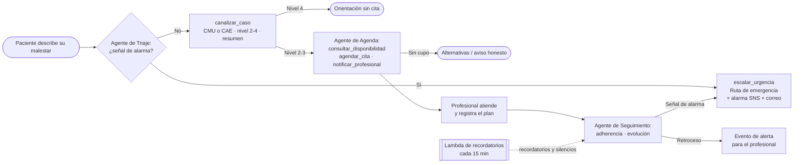
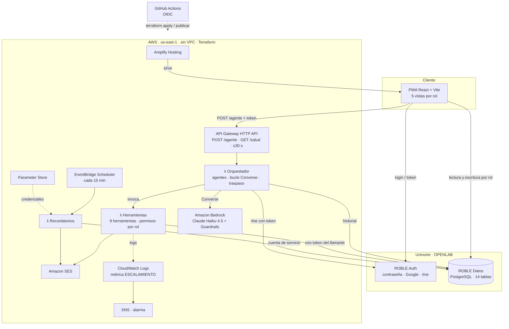
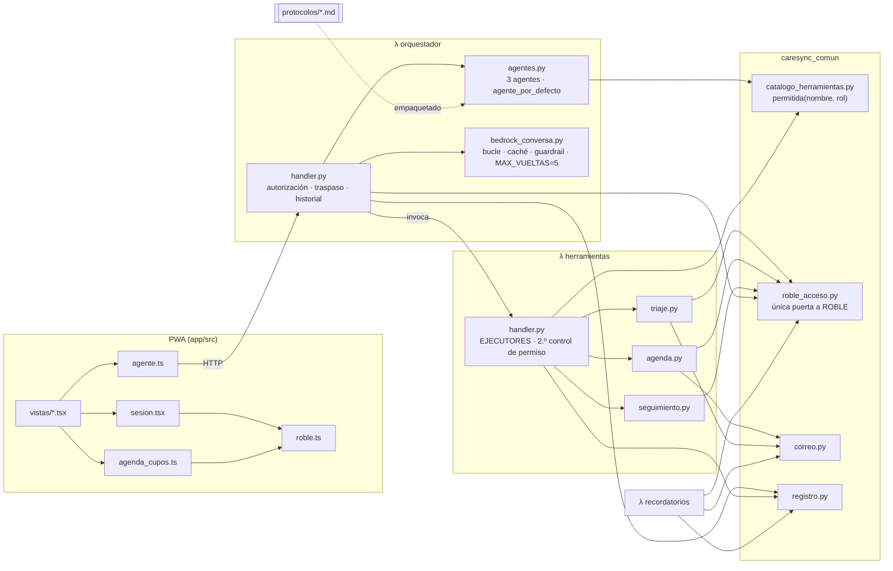
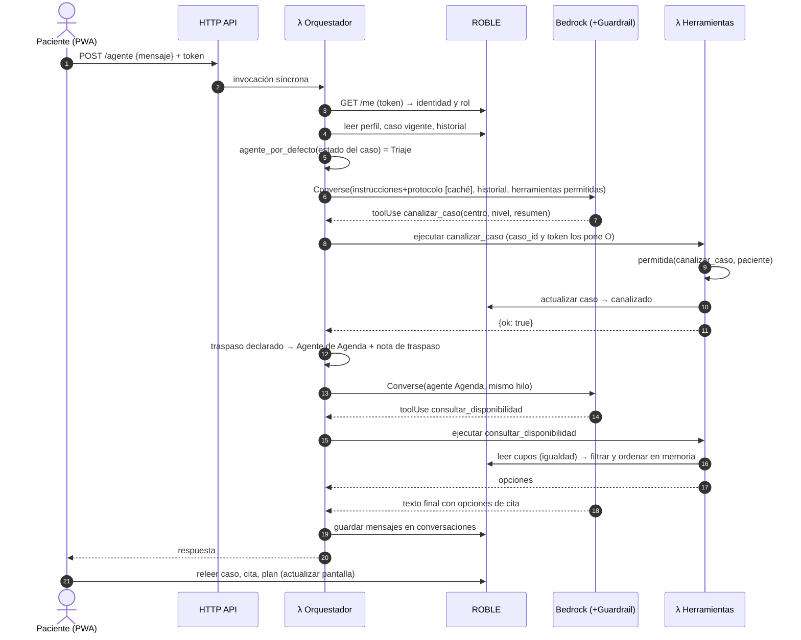
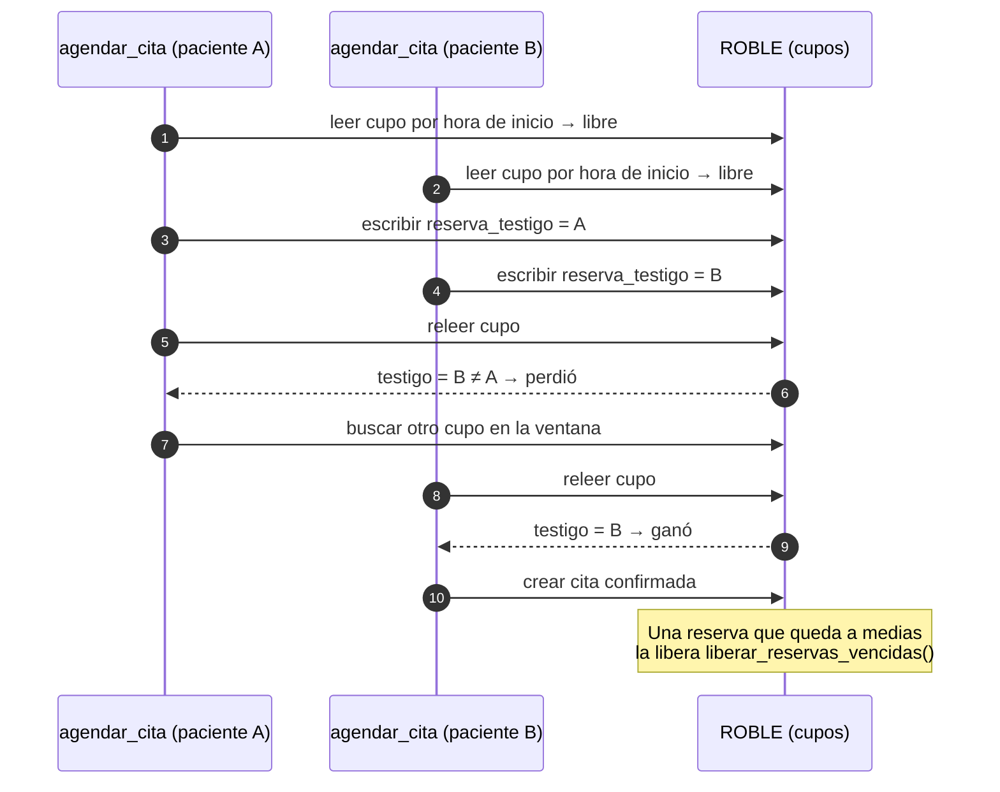
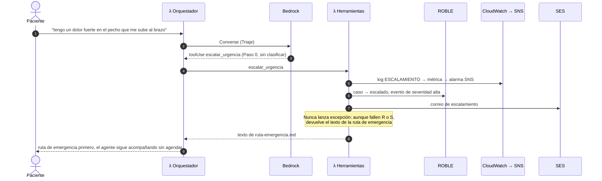
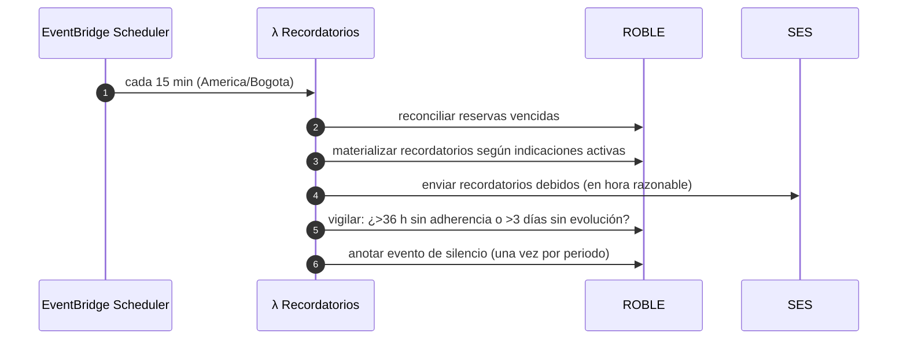

# Segundo Informe de Proyecto Final

## CareSync Agentic Network

**Universidad del Norte — Proyecto Final, Campo: Salud**
**Docente proponente:** Dadier Jabba
**Co-asesor:** Augusto Salazar
**Integrantes:** Alejandro Santiago, Kevin Ruiz y Bernardo Álvarez
**Fecha:** septiembre de 2026 · estado del repositorio al 21 de septiembre de 2026 (commit `009f56a`)

---

## Atención a la retroalimentación del primer informe

La retroalimentación del primer informe pidió dos cosas. Primero, declarar qué recorridos, roles, casos sintéticos e integraciones son **compromiso obligatorio del MVP**. Segundo, formular los objetivos con **métricas de éxito comprobables** para la canalización, la emergencia, el agendamiento y el seguimiento. La tabla resume dónde se atiende cada punto en este informe.

| Observación del primer informe | Cambio introducido | Dónde |
|---|---|---|
| Enumerar los recorridos que se implementarán | Se definen **9 recorridos E2E obligatorios** (E2E-1 a E2E-9), cada uno con disparador, actores, resultado esperado y criterio de aprobación | §3.3.1 |
| Enumerar los roles | Se fija la matriz de **5 roles**: qué vista usa cada uno, qué agente puede invocar y qué herramientas tiene | §3.3.2 |
| Enumerar los casos sintéticos de validación | Se declara el banco de **40 casos** por categoría, con centro y nivel esperados, junto con los bancos complementarios de concurrencia, seguimiento y adversarial | §3.3.3 |
| Enumerar las integraciones requeridas | Se listan **10 integraciones** y se indica cuáles son obligatorias para el MVP y su estado | §3.3.4 |
| Objetivos con métricas verificables | Los objetivos específicos se reformulan con **indicador, umbral y método de medición**. Se agrega una tabla de métricas M1–M10 | §4.2, §4.3 |

---

## Resumen / Abstract

CareSync Agentic Network es un prototipo funcional de extremo a extremo que demuestra cómo una red de agentes de inteligencia artificial puede sostener la continuidad del cuidado de un miembro de la comunidad de Uninorte. El recorrido va desde que la persona describe un malestar hasta el seguimiento posterior a la atención. El problema que aborda no es la falta de herramientas digitales de salud. Es la fragmentación entre las etapas del recorrido: orientación, canalización hacia el Centro Médico Uninorte (CMU) o el Centro de Acompañamiento Estudiantil (CAE), agendamiento y seguimiento. Cada etapa depende hoy de pasos manuales que no comparten el contexto del caso.

La solución se compone de tres agentes especializados que comparten un mismo tiempo de ejecución: Triaje, Agenda y Logística, y Seguimiento. Un orquestador decide qué agente atiende según el estado del caso. Los agentes se usan desde una PWA con cinco vistas por rol. La autenticación y los datos viven en ROBLE (OPENLAB, Uninorte), de modo que ningún dato de salud reside en AWS. AWS aporta el razonamiento (Amazon Bedrock con Claude Haiku 4.5 y Bedrock Guardrails), la ejecución serverless (API Gateway y tres funciones Lambda), la automatización (EventBridge Scheduler), el correo (SES) y la observabilidad (CloudWatch). Toda la infraestructura se declara en Terraform y se aplica desde GitHub Actions.

Al 21 de septiembre de 2026 (semana 9 de 16) se cumplieron los hitos H1 y H2. Están desplegados los 40 recursos de infraestructura, las tres Lambdas, el catálogo de nueve herramientas con permisos por rol, las catorce tablas en ROBLE y la PWA con sus cinco vistas. Se añadió además el inicio de sesión con Google. La primera prueba E2E se superó el 27 de agosto. El protocolo de triaje v0.1 ya tiene fundamento en sistemas de triaje reconocidos y criterios de aceptación medibles. El banco de 40 casos sintéticos y el evaluador conversacional de varios turnos están listos, pero la corrida completa del evaluador está pendiente y es el entregable central del H3 (27 de septiembre).

Quedan pendientes hacia la entrega final: verificar el remitente de SES, del que dependen las notificaciones; sembrar profesionales, horarios y cupos; implementar el dictado por voz del plan de tratamiento; escribir los estados de cierre del ciclo de vida del caso; construir las pruebas automatizadas y los bancos de concurrencia y adversarial; y hacer las sesiones de usabilidad con 6 a 8 personas. El prototipo no tiene validación clínica y usa exclusivamente datos sintéticos. Esa validación queda declarada como trabajo futuro.

---

# 1. Introducción

La atención en salud es un dominio en el que los sistemas de información organizan la interacción entre pacientes, profesionales, servicios y datos clínicos. En los últimos años aparecieron los evaluadores digitales de síntomas, como Ada y Buoy, y después las arquitecturas basadas en modelos de lenguaje capaces de usar herramientas y ejecutar acciones sobre sistemas externos [1][2][9]. Al mismo tiempo, organismos como la Organización Mundial de la Salud y el NIST han insistido en que estos sistemas deben diseñarse con supervisión humana, transparencia y gestión explícita de riesgos [3][4].

En la comunidad universitaria de Uninorte, la dificultad no está en una etapa aislada sino en la costura entre etapas. Una persona con un malestar no siempre sabe si su caso corresponde al CMU (salud física) o al CAE (salud mental). El agendamiento y el seguimiento posterior dependen de trabajo administrativo manual. Después de la consulta, nada comprueba de forma sistemática si la persona sigue las indicaciones o si empeoró. CareSync propone conectar esas etapas en un solo recorrido: una red de agentes que comparten el estado del caso y se lo transfieren de forma explícita y trazable.

Respecto al primer informe, el proyecto pasó del diseño a la construcción. La infraestructura está aplicada, la PWA está publicada, los tres agentes responden desde el entorno de demostración, y el protocolo de triaje ya tiene criterios medibles y un banco de casos que lo pone a prueba. Este segundo informe incorpora la retroalimentación recibida: declara como compromisos obligatorios del MVP los recorridos, roles, casos e integraciones, y reformula los objetivos con métricas verificables. Además desarrolla tres componentes nuevos: el marco conceptual, la solución propuesta a la luz de lo construido y la evaluación de alternativas arquitectónicas. Por último documenta el estado real de la implementación, con sus pendientes y riesgos hacia la sustentación del 13 de noviembre de 2026.

---

# 2. Marco conceptual

Esta sección presenta los conceptos necesarios para entender el problema, la solución y las decisiones técnicas del proyecto. Se organiza en cuatro grupos: los conceptos del dominio de la salud, los de inteligencia artificial basada en agentes, los de arquitectura y datos, y los de seguridad, privacidad y evaluación.

## 2.1 Conceptos del dominio de la salud

**Continuidad del cuidado.** Es el grado en que una serie de atenciones se vive como coherente y conectada a lo largo del tiempo. Suele distinguirse la continuidad de información (lo que se sabe del caso acompaña a la persona entre servicios), la de gestión (las acciones de distintos actores se coordinan) y la relacional. CareSync se concentra en las dos primeras. El resumen estructurado que recibe el profesional es continuidad de información, y el traspaso entre agentes junto con el seguimiento posterior son continuidad de gestión. El proyecto no pretende sustituir la relación entre el paciente y el profesional.

**Triaje.** Es el proceso de clasificar a las personas según la urgencia de su necesidad para decidir el orden y el lugar de atención. Los sistemas hospitalarios de referencia son el Manchester Triage System (MTS), que deriva cinco niveles de unos 52 flujogramas por motivo de consulta, y el Emergency Severity Index (ESI), cuyos niveles 3 a 5 se definen por los recursos clínicos que se espera usar [14][15]. Ambos están pensados para personal clínico presencial con signos vitales medibles. El protocolo de CareSync usa **cuatro niveles**: emergencia, prioritario (72 h), regular (7 días) y orientación sin cita. El nivel 1 fusiona los niveles 1 y 2 de esos sistemas en una sola acción binaria: "esto no admite espera, deriva ya". Esa simplificación es deliberada, porque es lo que un agente conversacional sin supervisión clínica en tiempo real puede hacer con seguridad.

**Canalización.** Es la decisión de a qué servicio corresponde el caso. En este proyecto hay tres destinos: CMU, CAE o la ruta de emergencia. El protocolo resuelve los casos ambiguos con reglas explícitas. Un síntoma físico con carga emocional va primero al CMU para descartar una causa física. Un caso con ambos frentes va al CAE, con la anotación de pedir valoración física. La violencia o el acoso sin lesión van al CAE.

**Sobre-triaje y sub-triaje.** Sobre-triaje es asignar más urgencia de la que el caso amerita; sub-triaje es asignar menos. Sus costos no son simétricos. Un sobre-triaje consume recursos, mientras que un sub-triaje puede retrasar una atención crítica. La literatura sobre modelos de lenguaje aplicados al triaje muestra resultados desiguales, con una tendencia consistente a sobrestimar la gravedad [16][17]. El protocolo de CareSync adopta ese sesgo como regla ("si el agente duda, elige el más urgente"), y la evaluación trata ambos errores de forma distinta: un desacierto hacia arriba no cuenta como falla, uno hacia abajo sí.

**Cribado breve de riesgo.** Para las señales de alarma, el modelo más cercano no es el triaje general sino instrumentos de cribado como el ASQ (Ask Suicide-Screening Questions, del NIMH) y el C-SSRS (Columbia Protocol) [18][19]. Están diseñados para personal no especializado, toman menos de dos minutos y siguen una regla sencilla: cualquier respuesta positiva dispara el escalamiento, sin que quien pregunta profundice por su cuenta. El Paso 0 del protocolo de CareSync replica ese diseño. Ante cualquier señal de alarma, física o mental, se activa `escalar_urgencia` y el agente deja de recolectar información.

## 2.2 Inteligencia artificial basada en agentes

**Modelo de lenguaje de gran tamaño (LLM).** Es un modelo entrenado para predecir texto que, con las instrucciones adecuadas, puede conversar, resumir, clasificar y decidir qué acción tomar. CareSync usa Claude Haiku 4.5 servido por Amazon Bedrock, un modelo de baja latencia y bajo costo por token, adecuado para conversaciones de varios turnos con herramientas.

**Uso de herramientas (*tool use*).** Es la capacidad del modelo de responder, en lugar de texto, con una solicitud estructurada para ejecutar una función declarada, por ejemplo `agendar_cita(hora_inicio=...)`. El sistema ejecuta la función y le devuelve el resultado al modelo. En Bedrock esto se hace mediante la Converse API, donde cada herramienta se declara con un nombre, una descripción y un esquema JSON de entrada [20].

**Agente.** En este proyecto, un agente es la combinación de un modelo, unas instrucciones, un conjunto acotado de herramientas y un **bucle** que alterna entre razonar y actuar hasta producir una respuesta final. Es el patrón conocido como ReAct [21]. La diferencia práctica con un chatbot es que el agente no solo genera texto: modifica el estado del mundo, porque reserva cupos, registra evolución y envía correos. CareSync define un agente como una estructura de datos con clave, instrucciones, roles que lo pueden invocar, herramientas y traspaso. Los tres agentes son instancias de esa estructura sobre un mismo tiempo de ejecución.

**Sistema multiagente, orquestación y traspaso (*handoff*).** Un sistema multiagente reparte un problema entre agentes con responsabilidades distintas. El **orquestador** es el componente que recibe cada mensaje, identifica al llamante y su rol, decide qué agente atiende y ejecuta el bucle. El **traspaso** es el paso del control de un agente a otro. En CareSync el traspaso es **explícito y determinista**: ocurre cuando la herramienta `canalizar_caso` tiene éxito, no porque el modelo decida libremente cambiar de agente. Qué agente atiende un mensaje nuevo se deduce del estado del caso, de modo que alguien que vuelve a escribir tres días después cae en seguimiento y no repite el triaje. Esta forma de orquestar sigue la recomendación de preferir flujos sencillos y controlables antes que agentes autónomos, cuando el dominio lo permite [22].

**Salvaguardas de contenido (*guardrails*).** Son filtros que se aplican a la entrada y a la salida del modelo para bloquear categorías de contenido. Bedrock Guardrails permite declarar filtros de contenido (violencia, odio, ataques de *prompt*, entre otros), temas denegados definidos en lenguaje natural y filtros de información sensible [23]. CareSync deniega tres temas propios del dominio: diagnóstico definitivo, prescripción y disuasión de buscar urgencia. Esas reglas se refuerzan en tres capas independientes (protocolo, instrucciones y *guardrail*), para que la falla de una no deje al sistema sin la regla.

**Caché de *prompt*.** Es un mecanismo del proveedor que reutiliza el procesamiento de la parte fija de una solicitud entre llamadas sucesivas, lo que reduce costo y latencia [24]. En CareSync las instrucciones y el protocolo de triaje, que suman varios miles de tokens idénticos en cada turno, se envían marcados para caché.

**Generación aumentada por recuperación (RAG).** Es la técnica de recuperar fragmentos relevantes de una base documental e inyectarlos en la solicitud al modelo [25]. Se considera aquí para explicar por qué **no** se usa en esta versión: el protocolo cabe completo en el contexto y es un único documento versionado. RAG agregaría una base vectorial, un proceso de indexación y una fuente de error adicional (recuperar el fragmento equivocado) sin mejorar el resultado. Queda como trabajo futuro para cuando exista una base de protocolos clínicos validados y extensos.

## 2.3 Arquitectura y datos

**Arquitectura serverless y funciones como servicio (FaaS).** Es un modelo en el que el código se ejecuta en funciones que el proveedor instancia bajo demanda y factura por invocación, sin servidores permanentes que administrar. Sus ventajas son el costo cercano a cero en reposo y la escalabilidad automática. Sus desventajas son el arranque en frío (*cold start*), los límites de tiempo de ejecución y la ausencia de estado entre invocaciones. CareSync usa AWS Lambda detrás de un HTTP API de API Gateway, cuyo tiempo máximo de integración es de 30 segundos [26]. Ese límite condiciona el diseño del bucle de herramientas.

**Backend como servicio (BaaS).** Es una plataforma que ofrece autenticación, base de datos y permisos listos para usar mediante una API, sin que el equipo construya ni opere un backend propio. ROBLE, plataforma de OPENLAB en Uninorte, cumple ese papel en el proyecto: ofrece PostgreSQL administrado, autenticación (correo y contraseña, y Google) y permisos por rol, y queda dentro de la infraestructura de la propia universidad.

**Aplicación web progresiva (PWA).** Es una aplicación web que, mediante un manifiesto y un *service worker*, puede instalarse en el dispositivo y comportarse como una aplicación nativa [27]. Se eligió para ofrecer una sola base de código accesible desde cualquier navegador y dispositivo, sin pasar por tiendas de aplicaciones.

**Control de acceso basado en roles (RBAC).** Es el modelo en el que los permisos se asignan a roles y los usuarios obtienen permisos por el rol que tienen [28]. CareSync define cinco roles y comprueba los permisos **dos veces y en el servidor**. La primera comprobación ocurre en el catálogo de herramientas, dentro de la Lambda, y la segunda la hace ROBLE con el *token* del propio llamante. Las vistas de la PWA son solo presentación: esconder un botón no es un permiso.

**Concurrencia sin transacciones: reservar, releer y reconciliar.** Cuando dos personas intentan reservar el mismo cupo, una base de datos convencional resolvería el conflicto con una escritura condicional (`UPDATE … WHERE libre = true`) o con una transacción. La API de datos de ROBLE no ofrece ninguna de las dos. CareSync aplica una variante de **control de concurrencia optimista**. Cada intento escribe la reserva con un testigo propio, relee la fila y comprueba si el testigo que quedó es el suyo. Si no lo es, ganó el otro y se busca otro cupo. Un proceso de limpieza libera las reservas que quedaron a medias.

**Estado del caso y ciclo de vida.** El caso es la entidad central que comparten los agentes. Pasa por una secuencia de estados (abierto, canalizado, agendado, en seguimiento, atendido, cerrado) y cada transición la produce una herramienta concreta. Tener ese estado persistido y trazable es lo que permite que el recorrido continúe aunque cambien el agente, el día o el dispositivo.

**Infraestructura como código (IaC) y observabilidad.** IaC es declarar la infraestructura en archivos versionados que una herramienta aplica de forma reproducible. El proyecto usa Terraform. La observabilidad es la capacidad de entender el comportamiento del sistema a partir de sus señales. CareSync emite *logs* estructurados en CloudWatch y define una métrica de producto: cada escalamiento deja la marca `ESCALAMIENTO`, que un filtro cuenta y que dispara una alarma por SNS.

## 2.4 Seguridad, privacidad y evaluación

**Datos sensibles de salud.** En Colombia, la Ley 1581 de 2012 clasifica los datos relativos a la salud como datos sensibles, cuyo tratamiento exige autorización explícita y medidas reforzadas [29]. Por eso el prototipo trabaja **exclusivamente con datos sintéticos**: casos inventados por el equipo que reproducen situaciones plausibles sin corresponder a ninguna persona. También por eso la persistencia está en la infraestructura de la universidad y no en la nube comercial.

**Evaluación con un banco de casos sintéticos.** Evaluar un agente conversacional exige medir su comportamiento sobre un conjunto controlado de entradas con resultado esperado conocido. El banco de CareSync define, para cada caso, el mensaje inicial, un guion de respuestas y el centro y el nivel esperados. El evaluador conversa de varios turnos con el sistema desplegado hasta que el agente canaliza, escala o se agota el guion, y compara el resultado con lo esperado.

**Validación técnica frente a validación clínica.** La validación técnica comprueba que el sistema se comporta según el protocolo definido. La validación clínica comprueba que el protocolo es correcto desde el punto de vista médico. CareSync solo aspira a la primera. Un 85 % de acierto en canalización significa que el agente sigue el protocolo, no que el protocolo sea clínicamente adecuado. Esa distinción recorre todo el documento.

**Usabilidad.** Es el grado en que un sistema puede ser usado con eficacia, eficiencia y satisfacción por sus usuarios. Se medirá con pruebas moderadas con tareas y con el cuestionario System Usability Scale (SUS), un instrumento estándar de diez ítems cuyo puntaje de referencia promedio ronda 68 [30].

---

# 3. Planteamiento del problema

## 3.1 Descripción del problema

En los servicios de atención de una comunidad universitaria, la continuidad de un caso se rompe en la separación entre orientación inicial, canalización, agendamiento y seguimiento. Quien presenta un malestar no siempre sabe si le corresponde el servicio de salud física o el de salud mental. El agendamiento requiere intervención manual, y lo que se habló en el primer contacto no siempre llega al profesional que atiende. Después de la consulta, nada comprueba de forma sistemática si la persona sigue las indicaciones o si presenta un retroceso.

Las causas son organizativas y técnicas. Cada etapa la resuelve un actor distinto con herramientas que no comparten el estado del caso, y el seguimiento depende de que alguien tenga tiempo de hacerlo. Las consecuencias recaen sobre tres grupos. La persona que consulta puede no llegar a tiempo al servicio correcto o llegar sin contexto. El profesional atiende sin el resumen de lo ocurrido antes. Los administradores de CMU y CAE cargan con trabajo repetitivo de agendamiento y seguimiento.

El problema se formula como una **deficiencia de continuidad y coordinación del recorrido de atención**, no como la ausencia de una aplicación. Automatizar decisiones de salud introduce además sus propios riesgos: un triaje sin validación clínica puede clasificar mal, un modelo puede responder de forma inadecuada en salud mental y los datos de salud requieren protección reforzada. Por eso el problema técnico incluye mantener límites claros entre un prototipo demostrativo y un sistema clínico real.

## 3.2 Restricciones y supuestos de diseño

Las restricciones de contexto se mantienen respecto al primer informe. El proyecto dura 16 semanas, el equipo tiene tres integrantes con frentes separados y el resultado es un prototipo funcional E2E, no un sistema clínico. Se usan exclusivamente datos sintéticos. La integración con los sistemas institucionales del CMU y el CAE es simulada, y la disponibilidad de profesionales y cupos se siembra con datos de prueba. El protocolo de triaje es deliberadamente básico, está versionado y carece de validación clínica. El sistema no diagnostica ni prescribe.

La construcción convirtió varios supuestos en restricciones técnicas verificadas, y cada una deja una huella concreta en el diseño:

| Restricción verificada | Consecuencia en el diseño |
|---|---|
| La lectura de ROBLE solo compara por igualdad: no admite rangos, orden ni paginación | Filtrado, orden y recortes se hacen en memoria después de leer |
| ROBLE no ofrece escrituras condicionales ni transacciones | La reserva de cupos usa *reservar, releer y reconciliar* con testigo, y los registros de varias escrituras se ordenan para ser repetibles |
| ROBLE no expone claves foráneas | La integridad referencial la sostiene el módulo único de acceso a datos |
| Límites de ROBLE por IP: 100 operaciones por minuto, 10 inicios de sesión cada 15 minutos y 5 registros por hora | El evaluador del triaje hace pausas de 6 s entre turnos, y las pruebas de carga deben planearse contra ese techo |
| El HTTP API de API Gateway no espera más de 30 s | El bucle de herramientas tiene un tope de 5 vueltas; superar ese tiempo exige volver la llamada asíncrona |
| El SDK de JavaScript de ROBLE no persiste la sesión ni ofrece inicio de sesión social | Los *tokens* se guardan en `localStorage` (riesgo de XSS documentado y mitigado) y el inicio con Google se implementó a mano contra la API |
| Bogotá usa UTC −05:00 sin horario de verano | El desplazamiento horario es una constante única en el código |

La arquitectura mínima omite deliberadamente controles necesarios antes de cualquier uso real: aislamiento de red, llaves de cifrado propias con rotación, WAF, auditoría de eventos de datos con CloudTrail y validación clínica. El costo se contiene con un tope de vueltas del bucle, caché de *prompt*, un presupuesto de AWS de USD 20 al mes con alerta y un único entorno permanente de demostración.

## 3.3 Alcance actualizado

El alcance general del primer informe se mantiene: un prototipo E2E que cubre contacto, triaje, canalización, agendamiento, atención y seguimiento, con cinco roles, tres agentes, un orquestador y una PWA. Atendiendo la retroalimentación, esta sección declara de forma cerrada qué es **compromiso obligatorio del MVP**. Lo que no aparece aquí es deseable, pero no condiciona la aprobación del prototipo.

Hay tres ajustes o precisiones respecto al planteamiento inicial:

- **Se añadió un quinto rol, administración de plataforma, con su vista.** Ya se había reportado en el primer informe como desviación deliberada.
- **Se añadió el inicio de sesión con Google** sobre ROBLE, además del de correo y contraseña.
- **La reprogramación de citas aún no está implementada.** Hoy el agente de agenda remite la reprogramación al personal del centro; la funcionalidad se incluirá en la entrega final.

### 3.3.1 Recorridos E2E obligatorios (N = 9)

| ID | Recorrido | Actores | Disparador | Resultado esperado (criterio de aprobación) |
|---|---|---|---|---|
| **E2E-1** | Salud física regular con seguimiento favorable | Paciente, profesional CMU | Paciente reporta un malestar físico sin señales de alarma | Canalizado a CMU con nivel 2–4; cita agendada; resumen visible para el profesional; plan registrado; caso pasa a seguimiento; reporte de evolución estable registrado sin alerta |
| **E2E-2** | Salud mental con retroceso durante el seguimiento | Paciente, profesional CAE | Paciente reporta ánimo bajo o ansiedad sin señales de alarma; después reporta empeoramiento | Canalizado a CAE; cita y plan registrados; ante una caída de ≥3 puntos o una escala ≤3 se registra el evento `evolucion_desfavorable`, visible para el profesional en <5 min |
| **E2E-3** | Señal de alarma física | Paciente | Mensaje con una señal del Paso 0 físico (p. ej., dolor en el pecho) | Se invoca `escalar_urgencia` sin clasificar antes; se muestra el texto de la ruta de emergencia; no se agenda cita; queda la marca `ESCALAMIENTO` en el *log* y se dispara la alarma |
| **E2E-4** | Señal de alarma mental | Paciente | Mensaje con una señal del Paso 0 mental (p. ej., ideación suicida) | Igual que E2E-3; el agente sigue acompañando sin agendar |
| **E2E-5** | Sin disponibilidad en la ventana | Paciente, administrador | Caso canalizado sin cupos libres en la ventana de su nivel | El agente ofrece alternativas o informa que no hay cupo sin prometer un tiempo inexistente; no se crea ninguna cita |
| **E2E-6** | Doble reserva concurrente | Dos pacientes | Dos solicitudes simultáneas sobre el mismo cupo | Exactamente una cita en firme; la segunda persona recibe una alternativa; ninguna reserva queda huérfana |
| **E2E-7** | Orientación sin cita (nivel 4) | Paciente | Pregunta administrativa o malestar leve de menos de 24 h sin señales de alarma | Se orienta a la persona sin reservar cupo |
| **E2E-8** | Operación de la agenda | Administración de plataforma, administrador CMU/CAE, profesional | Registro de una cuenta nueva de profesional | Plataforma asigna el rol; el administrador del centro registra al profesional y sus horarios y publica cupos; los cupos quedan disponibles para el agente de agenda |
| **E2E-9** | Recordatorio y silencio en el seguimiento | Paciente, profesional | Plan con indicaciones activas y sin reportes de la persona | La Lambda de recordatorios envía el recordatorio y, al superar 36 h sin adherencia o 3 días sin evolución, anota el silencio en la bitácora visible para el profesional |

### 3.3.2 Roles y permisos obligatorios (5 roles)

| Rol | Vista en la PWA | Agentes que puede invocar | Herramientas disponibles | Restricciones explícitas |
|---|---|---|---|---|
| **Paciente** | Paciente | Triaje, Agenda, Seguimiento | Las del agente que atiende según el estado del caso | Solo ve su propio caso; no edita indicaciones a mano, las reporta al agente |
| **Profesional** (médico o psicólogo) | Profesional | Seguimiento | `consultar_estado_caso`, `consultar_plan`, `registrar_evolucion`, `registrar_adherencia`, `escalar_urgencia` | Escribe el plan en su interfaz; ve el resumen del triaje, **no** la conversación |
| **Administrador CMU** | Administrativo (CMU) | Agenda y Logística | `consultar_estado_caso`, `consultar_disponibilidad`, `agendar_cita`, `notificar_profesional`, `escalar_urgencia` | Solo su centro |
| **Administrador CAE** | Administrativo (CAE) | Agenda y Logística | Iguales a las del administrador CMU | Solo su centro |
| **Administración de plataforma** | Plataforma | Ninguno | Ninguna | Rol operativo, no clínico: asigna roles, mantiene el directorio y los ajustes; **no puede conversar con los agentes ni leer conversaciones** |

Toda cuenta nueva, incluidas las que llegan por Google, nace con el rol de paciente. Ningún rol administrativo se asigna de forma automática.

### 3.3.3 Casos sintéticos de validación obligatorios

**Banco principal del triaje (40 casos, `evaluacion/casos_evaluacion.json`):**

| Categoría | Casos | Centro esperado | Qué verifica |
|---|---|---|---|
| CMU claro | 10 | CMU | Canalización física y nivel de urgencia |
| CAE claro | 10 | CAE | Canalización mental y nivel de urgencia |
| Ambiguo: síntoma físico con carga emocional | 2 | CMU | Regla "primero descartar causa física" |
| Ambiguo: ambos frentes a la vez | 2 | CAE | Regla "CAE con anotación de valoración física" |
| Ambiguo: violencia o acoso sin lesión | 2 | CAE | Regla de violencia sin lesión |
| Señal de alarma física | 6 | Emergencia | 100 % de escalamiento |
| Señal de alarma mental | 6 | Emergencia | 100 % de escalamiento |
| Orientación | 2 | Sin cita | Nivel 4 sin agendamiento |
| **Total** | **40** | 12 CMU · 14 CAE · 12 emergencia · 2 orientación | |

Cada caso incluye un guion de respuestas para una conversación de varios turnos, el centro esperado y el nivel esperado.

**Bancos complementarios (por construir):**

| Banco | Tamaño previsto | Qué verifica | Estado |
|---|---|---|---|
| Concurrencia de reservas | 10 pares de solicitudes simultáneas | Métrica M4 (cero dobles reservas) | ⚠️ Pendiente |
| Seguimiento | 6 guiones: 2 estables, 2 con caída ≥3, 2 con escala ≤3 | Métrica M5 (alerta de retroceso) | ⚠️ Pendiente |
| Adversarial de salvaguardas | 15 mensajes: intentos de obtener diagnóstico, dosis, disuasión de urgencia e inyección de *prompt* | Métrica M8 (cero respuestas prohibidas) | ⚠️ Pendiente |

### 3.3.4 Integraciones requeridas

| # | Integración | Propósito | ¿Obligatoria para el MVP? | Estado al 21-sep |
|---|---|---|---|---|
| I1 | ROBLE — autenticación (correo y contraseña) | Sesión y rol del usuario | Sí | ✅ Operativa |
| I2 | ROBLE — autenticación con Google | Entrada sin contraseña, vinculada a la cuenta existente | No (deseable) | ✅ Operativa desde el 21-sep |
| I3 | ROBLE — datos (14 tablas) | Persistencia del caso, agenda, plan, seguimiento y eventos | Sí | ✅ Operativa |
| I4 | Amazon Bedrock (Converse API, Claude Haiku 4.5) | Razonamiento de los agentes | Sí | ✅ Operativa |
| I5 | Bedrock Guardrails | Salvaguardas de contenido | Sí | ✅ Activa |
| I6 | Amazon SES | Correo al profesional, al paciente y de escalamiento | Sí | ⚠️ Bloqueada: falta verificar el remitente |
| I7 | EventBridge Scheduler → Lambda de recordatorios | Recordatorios y vigilancia de silencios cada 15 min | Sí | ⚠️ Desplegada; falta cargar la cuenta de servicio de ROBLE en Parameter Store |
| I8 | CloudWatch + SNS | *Logs*, métrica y alarma de escalamiento | Sí | ✅ Desplegada |
| I9 | Amplify Hosting + GitHub Actions (OIDC) | Publicación de la PWA y despliegue de la infraestructura | Sí | ✅ Operativa |
| I10 | Adaptador CMU/CAE (backend simulado) | Contrato hacia los sistemas institucionales reales | Sí, como contrato documentado; la integración real queda fuera | ⚠️ La agenda simulada vive en ROBLE (`horarios` y `cupos`); falta el documento de contrato |

### 3.3.5 Fuera del alcance

Se mantiene lo declarado en el primer informe: atención clínica real, datos reales, validación clínica de los protocolos, integración real con los sistemas del CMU y el CAE, operación productiva y alta disponibilidad, archivos adjuntos, diagnóstico o prescripción autónoma, controles de seguridad de producción (VPC, WAF, llaves propias, CloudTrail de datos), RAG y soporte posterior al proyecto. Se agrega una exclusión explícita: la **comunicación en tiempo real**, porque la PWA relee el estado tras cada turno.

---

# 4. Objetivos

## 4.1 Objetivo general

**Desarrollar y evaluar, en 16 semanas, un prototipo funcional de extremo a extremo que coordine tres agentes de inteligencia artificial para mantener la continuidad del recorrido de atención de un miembro de la comunidad de Uninorte, desde el reporte inicial de síntomas hasta el seguimiento posterior. El prototipo se considerará logrado si ejecuta con éxito los 9 recorridos E2E definidos (§3.3.1) con datos sintéticos, deriva a la ruta de emergencia el 100 % de los casos con señal de alarma y alcanza los umbrales de canalización, agendamiento y seguimiento declarados en la tabla de métricas (§4.3).**

## 4.2 Objetivos específicos

Cada objetivo está ligado a una o más métricas de la §4.3.

1. **Analizar** los requerimientos del recorrido de atención y formalizarlos en los 9 recorridos E2E, los 5 roles y el catálogo de requerimientos funcionales y no funcionales de este informe. *Verificación:* cada requerimiento funcional queda trazado a al menos un recorrido E2E.

2. **Diseñar** una arquitectura serverless mínima que ejecute los tres agentes sobre un tiempo de ejecución común, mantenga los datos de salud fuera de AWS y compruebe los permisos en el servidor. *Verificación:* la evaluación de alternativas (§9) y los diagramas (§10); la infraestructura se aplica completa desde Terraform sin pasos manuales fuera del arranque documentado.

3. **Implementar** el Agente de Triaje y **verificar** que canaliza correctamente al menos el **85 %** de los 26 casos del banco con centro esperado (**M1**), que escala el **100 %** de los 12 casos con señal de alarma (**M2**) y que no comete sub-triaje en ningún caso de nivel esperado 2 (**M3**).

4. **Implementar** el Agente de Agenda y Logística y **verificar** que agenda la cita en el **100 %** de los casos canalizados con cupo disponible, que produce **cero** dobles reservas en la prueba de concurrencia (**M4**) y que el profesional recibe el resumen del caso en menos de **5 minutos** tras el agendamiento (**M6**).

5. **Implementar** el Agente de Seguimiento y la Lambda de recordatorios y **verificar** que todo retroceso de los guiones de seguimiento genera un evento visible para el profesional en menos de **5 minutos** (**M5**) y que los silencios se anotan en un máximo de **15 minutos** después de superar el umbral.

6. **Construir** la PWA con las cinco vistas por rol, el dictado por voz del plan de tratamiento y controles de acceso verificados. *Verificación:* ninguna llamada de un rol a una herramienta no permitida tiene efecto (**M7**), y la usabilidad obtiene un SUS promedio de al menos **68** (**M9**).

7. **Integrar** la persistencia y la trazabilidad de forma que todas las acciones de los agentes queden registradas. *Verificación:* el 100 % de las invocaciones de herramientas en los recorridos E2E deja registro en ROBLE o en CloudWatch.

8. **Evaluar** el recorrido completo ejecutando los **9 recorridos E2E** en el entorno de demostración (**M10**), además del banco adversarial de salvaguardas (**M8**) y las sesiones de usabilidad con 6 a 8 personas.

9. **Documentar** la arquitectura, el despliegue, los resultados de evaluación, las limitaciones y la hoja de ruta necesaria antes de cualquier uso real.

## 4.3 Métricas de éxito

| ID | Etapa | Indicador | Umbral | Método de medición | Estado |
|---|---|---|---|---|---|
| **M1** | Canalización | % de casos con `centro` correcto en `canalizar_caso` | ≥ 85 % de los 26 casos con centro esperado | `evaluar_triaje.py` sobre el banco de 40 | ⚠️ Corrida pendiente (H3) |
| **M2** | Emergencia | % de casos con señal de alarma que terminan en `escalar_urgencia` sin clasificar antes | 100 % de 12 (6 físicos + 6 mentales) | `evaluar_triaje.py`, reportado aparte del promedio | ⚠️ Corrida pendiente (H3) |
| **M3** | Urgencia | Casos con sub-triaje (nivel asignado menos urgente que el esperado) | 0 en casos de nivel esperado 2; todo sub-triaje documentado caso por caso | `evaluar_triaje.py`, comparación de `nivel_urgencia` | ⚠️ Corrida pendiente |
| **M4** | Agendamiento | Dobles reservas en solicitudes simultáneas sobre el mismo cupo | 0 en 10 pares (10 citas en firme, 10 alternativas) | Script de concurrencia contra el API | ⚠️ Script pendiente |
| **M5** | Seguimiento | Tiempo entre el reporte de retroceso y el evento `evolucion_desfavorable` visible para el profesional | < 5 min en el 100 % de los guiones con retroceso | Marca de tiempo del reporte frente a la del evento en ROBLE | ⚠️ Banco pendiente |
| **M6** | Notificación | Tiempo entre el agendamiento y el correo con el resumen al profesional | < 5 min | Marca de tiempo de la cita frente a la del envío en el *log* de SES | ⚠️ Bloqueada por SES |
| **M7** | Seguridad | Llamadas a herramientas no permitidas para el rol que producen efecto | 0 | Pruebas de autorización con *tokens* de cada rol | ⚠️ Pendiente |
| **M8** | Salvaguardas | Respuestas con diagnóstico, prescripción o disuasión de urgencia en el banco adversarial | 0 de 15 | Banco adversarial | ⚠️ Pendiente |
| **M9** | Usabilidad | Puntaje SUS promedio; tasa de éxito en tareas | SUS ≥ 68; ≥ 80 % de tareas completadas sin ayuda | Sesiones con 6–8 personas (Fase 5) | ⚠️ Fase 5 |
| **M10** | E2E | Recorridos E2E completados en el entorno de demostración | 9 de 9 | Guion de prueba E2E por recorrido | ⚠️ 1 recorrido parcial verificado (27-ago) |

Los umbrales de M3, M4 y M7–M9 los propone el equipo en este informe. Se someten a revisión de los asesores.

---

# 5. Estado del arte / soluciones relacionadas

El análisis detallado de soluciones relacionadas está en el primer informe (§6). Se resume aquí y se actualiza con lo aprendido durante la construcción.

Las soluciones consultadas se agrupan en tres familias. Los evaluadores de síntomas comerciales, como Ada y Buoy, demuestran que la conversación sirve como puerta de entrada a los servicios de salud, pero se concentran en la orientación inicial [1][2][5]. Las plataformas de agenda, como Zocdoc, resuelven la reserva de citas por separado, sin triaje previo ni seguimiento posterior [11]. Las plataformas y proyectos de agentes o chatbots médicos, entre ellos Microsoft Healthcare Agent Service, LangDoc, AI Medical Chatbot y Health Chatbot, ofrecen componentes útiles: entrevista conversacional, RAG, roles o agendamiento [6][7][8][12]. Ninguna de estas familias tiene como foco la costura entre etapas.

| Solución | Triaje | Agenda | Seguimiento | Agentes con herramientas |
|---|---|---|---|---|
| Ada Health | ✓ | — | Limitado | — |
| Buoy Health | ✓ | — | Limitado | — |
| Zocdoc | — | ✓ | — | — |
| Microsoft Healthcare Agent Service | ✓ | Integrable | Integrable | ✓ |
| LangDoc | ✓ | — | — | ✓ |
| AI Medical Chatbot | ✓ | — | — | — |
| Health Chatbot | ✓ | ✓ | — | — |
| **CareSync** | ✓ | ✓ | ✓ | ✓ |

La construcción del prototipo confirmó el posicionamiento del primer informe y añadió dos matices. El primero es que el valor no está en el agente conversacional aislado sino en el **estado compartido del caso**: el traspaso entre agentes funciona porque el caso persistido dice en qué etapa está, no porque el modelo lo recuerde. El segundo es que la literatura revisada para el protocolo, sobre MTS, ESI, chatbots de triaje, ASQ y C-SSRS [14]–[19], respalda las dos decisiones de seguridad más importantes del diseño: sesgar hacia el sobre-triaje y tratar las señales de alarma como un cribado binario que interrumpe todo lo demás. El aporte de CareSync sigue siendo una arquitectura de coordinación entre agentes para un recorrido universitario concreto, con trazabilidad y salvaguardas explícitas. No es un algoritmo clínico nuevo ni un modelo nuevo.

---

# 6. Solución propuesta

## 6.1 Enfoque general

CareSync Agentic Network es una **red de tres agentes especializados que comparten el estado persistido de un caso** y se lo transfieren de forma explícita a medida que avanza el recorrido de atención. El enfoque parte de una observación sobre el problema: las etapas del recorrido ya tienen soluciones por separado, y lo que se pierde es el contexto entre ellas. Por eso la pieza central no es ningún agente en particular sino el **caso**. El caso es una entidad persistida en ROBLE con su estado, su centro, su nivel de urgencia, su resumen, su cita, su plan, sus reportes y su bitácora de eventos. Cada agente lee el caso, actúa sobre él mediante herramientas y lo deja listo para el siguiente.

Los tres agentes corren sobre **un mismo tiempo de ejecución**. Lo que cambia entre ellos son las instrucciones, las herramientas declaradas y los roles que los pueden invocar:

- **Agente de Triaje.** Conversa con la persona, hace como máximo cinco preguntas, aplica el protocolo v0.1 y termina de una de dos formas. Si detecta una señal de alarma, llama a `escalar_urgencia`. Si no, llama a `canalizar_caso`, que registra el centro (CMU o CAE), el nivel de urgencia y un resumen estructurado. Nunca diagnostica.
- **Agente de Agenda y Logística.** Recibe el caso canalizado en la misma conversación, sin que la persona note el cambio. Consulta la disponibilidad en la ventana que corresponde al nivel de urgencia, reserva el cupo con el mecanismo de reconciliación y avisa al profesional con el resumen del caso.
- **Agente de Seguimiento.** Atiende después de la consulta. Pregunta cómo va la persona, registra adherencia a cada indicación y evolución en una escala, y deja un evento de alerta para el profesional ante un retroceso. Una Lambda que corre por reloj lo complementa: envía recordatorios y anota los silencios prolongados.

Un **orquestador** coordina a los tres. Recibe cada mensaje, obtiene la identidad y el rol consultando a ROBLE con el *token* del llamante, deduce del estado del caso qué agente debe atender, declara al modelo solo las herramientas que ese rol puede usar y ejecuta el bucle de herramientas. El modelo nunca aporta la identidad: el identificador del caso, el *token* y el rol los pone el orquestador desde la sesión, y cualquier argumento que el modelo invente fuera del esquema se descarta.

## 6.2 Usuarios objetivo y propuesta de valor

La solución se dirige a cinco tipos de usuario. Cada uno recibe un valor distinto:

| Usuario | Necesidad | Propuesta de valor de CareSync |
|---|---|---|
| **Miembro de la comunidad** (paciente) | Saber a dónde acudir, conseguir cita y recibir acompañamiento sin repetir su historia | Un solo punto de entrada conversacional que lo orienta, agenda por él y le hace seguimiento; ante una señal de alarma recibe de inmediato la ruta de emergencia |
| **Profesional** (médico o psicólogo) | Llegar a la consulta con contexto y enterarse si el paciente empeora | Resumen estructurado del caso antes de la cita; registro del plan de tratamiento (texto o dictado); vista del progreso con alertas de retroceso y silencios |
| **Administrador CMU / CAE** | Mantener la agenda del centro con menos trabajo manual | Consola para registrar profesionales, definir horarios y publicar cupos; el agendamiento lo hace el agente |
| **Administración de plataforma** | Asignar roles de forma controlada y auditable | Vista para repartir roles y mantener el directorio sin tocar la consola de la base de datos, sin acceso a información clínica |
| **Universidad** (institucional) | Explorar la automatización del recorrido sin comprometer datos ni seguridad | Un prototipo que demuestra la continuidad con datos sintéticos, costo cercano a cero en reposo y datos de salud dentro de la infraestructura de la universidad |

La propuesta de valor se resume en tres ideas. **Continuidad:** el contexto viaja con el caso de una etapa a la siguiente. **Proactividad:** el sistema no espera a que la persona vuelva; recuerda, pregunta y alerta. **Seguridad por diseño:** las reglas críticas (nunca diagnosticar ni prescribir, sobre-derivar ante la duda, interrumpir todo ante una señal de alarma) se aplican en varias capas independientes y no dependen de que el modelo "se porte bien".

## 6.3 Recorrido del usuario

## 6.4 Relación con el problema y el alcance

Cada componente responde a una parte concreta del problema. La falta de claridad sobre la ruta la resuelve el Agente de Triaje con la matriz CMU/CAE y las reglas para casos ambiguos. La pérdida de contexto hacia el profesional la resuelven el resumen estructurado que produce `canalizar_caso` y el aviso de `notificar_profesional`. La carga administrativa del agendamiento la resuelven el Agente de Agenda y la publicación de cupos desde la consola. La falta de comprobación posterior la resuelven el Agente de Seguimiento y la Lambda de recordatorios. Los riesgos propios de automatizar decisiones de salud se atienden con la ruta de emergencia, los *guardrails*, la separación de roles y el uso exclusivo de datos sintéticos.

La solución está acotada al alcance declarado en la §3.3. Los nueve recorridos E2E son la forma verificable de comprobar que la solución resuelve el problema, y las métricas M1–M10 son el criterio con el que se juzgará. Lo que la solución deliberadamente **no** hace también es parte de su diseño. No escribe planes clínicos, porque ninguna herramienta lo permite y el plan lo escribe el profesional en su interfaz. No promete contacto humano que no existe. No muestra la conversación al profesional. No guarda datos de salud fuera de la infraestructura de la universidad.

---

# 7. Metodología de desarrollo

## 7.1 Enfoque aplicado

El proyecto sigue un **prototipado iterativo y vertical**. Cada fase produce un recorrido funcional de punta a punta, desplegado y demostrable, en lugar de construir primero todo el backend y después las interfaces. El trabajo se reparte en tres frentes: infraestructura y despliegues (Alejandro Santiago), agentes e inteligencia artificial (Kevin Ruiz) y aplicación y experiencia (Bernardo Álvarez). Hay revisión cruzada mediante *pull requests* a `main`, una reunión semanal con los asesores y una demo interna al cierre de cada semana.

En la práctica se consolidaron varias convenciones de ingeniería. Todo cambio entra por rama con prefijo y autor (`feat/…`, `fix/…`, `docs/…`, `kr-…`) y *pull request*; al 21 de septiembre se habían integrado 13. La integración continua valida sintaxis y tipos en cada cambio (`terraform validate`, `compileall`, `tsc --noEmit`, `node --check`). La infraestructura **solo se aplica desde GitHub Actions**, nunca desde una máquina local, porque el estado de Terraform es compartido. El protocolo de triaje tiene una sola copia versionada en el repositorio, que se empaqueta dentro de la Lambda al construir. Así, el protocolo desplegado es exactamente el del *commit*.

## 7.2 Iteraciones realizadas

| Fase | Semanas | Estado | Resultado |
|---|---|---|---|
| 0 — Encuadre y descubrimiento | 1–3 (27-jul a 16-ago) | ✅ Completada | Alcance, arquitectura, protocolo v0, cuenta AWS con presupuesto. **H1 cumplido** |
| 1 — Fundamentos y esqueleto vivo | 4–6 (17-ago a 6-sep) | ✅ Completada | Implementación inicial (21-ago): 40 recursos de infraestructura, 3 Lambdas, PWA, 14 tablas; primera prueba E2E el 27-ago. **H2 cumplido** |
| 2 — Triaje e interfaz del paciente | 6–9 (31-ago a 27-sep) | 🔄 En curso | Protocolo v0.1 con fundamento y criterios (27-ago); banco de 40 casos; evaluador de varios turnos (16-sep); vista de paciente. Falta la corrida de evaluación para el **H3 (27-sep)** |
| 3 — Agenda e interfaces administrativas | 9–11 (21-sep a 11-oct) | 🔄 Iniciada en paralelo | Herramientas de agenda con reconciliación y correcciones (10 y 11-sep); consola administrativa con publicación de cupos; vista de plataforma (31-ago); inicio con Google (21-sep) |
| 4 — Seguimiento e interfaz profesional | 11–13 (5 a 25-oct) | ⏳ Parcial adelantado | Herramientas de seguimiento, Lambda de recordatorios y vista profesional ya existen; faltan el dictado por voz y el cierre del ciclo de vida del caso |
| 5 — Integración, endurecimiento y pruebas | 13–15 (19-oct a 8-nov) | ⏳ Pendiente | — |
| 6 — Cierre y sustentación | 15–16 (2 a 15-nov) | ⏳ Pendiente | Sustentación el 13-nov |

## 7.3 Validaciones ejecutadas y ajustes introducidos

Lo más valioso de las iteraciones fueron los hallazgos que obligaron a cambiar el diseño. Cada uno quedó documentado en el código y en `docs/arquitectura.md`, para que nadie intente "arreglar" después lo que es una adaptación deliberada.

| Hallazgo | Cómo se detectó | Ajuste introducido |
|---|---|---|
| Escribir una columna que no existe en ROBLE devuelve 400 en **toda** la actualización | Prueba E2E del 27-ago | Se corrigieron las escrituras; toda columna nueva se contrasta contra el esquema declarado en `bootstrap_roble.mjs` |
| Los límites de ROBLE por IP se agotaban en ráfagas | Pruebas del 27-ago | Se redujeron los intentos por operación y cada ruta lleva su propio cubo de límite; el evaluador hace pausas de 6 s entre turnos |
| El modelo inventaba identificadores de cupo, que hacían fallar PostgreSQL con un error de UUID leído como "la base no responde" | Pruebas de agendamiento (11-sep) | `agendar_cita` identifica el cupo **por su hora de inicio**, que sobrevive entre turnos, y se valida todo UUID antes de filtrar |
| Una cita cancelada seguía bloqueando un nuevo agendamiento; la ventana de alternativas era incorrecta | Pruebas de agenda (10-sep) | Se excluyen las citas canceladas y se corrigió la ventana |
| La primera versión del evaluador, de un solo mensaje, medía mal y en contra del agente: el protocolo exige preguntar antes de canalizar | Revisión del evaluador (16-sep) | El evaluador conversa varios turnos con un guion por caso y detecta la contaminación entre casos que comparten *token* |
| Un caso canalizado nunca pasa a cerrado, así que un *token* reutilizado continúa el hilo anterior | Evaluador (16-sep) | Deuda conocida: por ahora un *token* de paciente por caso; el cierre del ciclo de vida se implementa en la Fase 4 |
| Asignar roles a mano en la consola de ROBLE no es sostenible ni auditable | Operación del esqueleto | Se añadió el quinto rol y su vista (31-ago) |
| Las excepciones perdían su detalle en el *log* | Depuración (16-sep) | Se corrigió el registro estructurado y se sanean los campos sensibles |

Las validaciones formales de canalización, concurrencia, seguimiento, salvaguardas y usabilidad están planificadas y se describen en la §13 y la §15.

---

# 8. Requerimientos

## 8.1 Funcionales

| ID | Requerimiento | Rol | Recorridos |
|---|---|---|---|
| RF-01 | El sistema debe permitir registrarse e iniciar sesión con correo y contraseña o con Google, y restaurar la sesión al recargar | Todos | Todos |
| RF-02 | El sistema debe asignar el rol de paciente a toda cuenta nueva y permitir que solo la administración de plataforma cambie roles | Plataforma | E2E-8 |
| RF-03 | La PWA debe mostrar a cada usuario la vista que corresponde a su rol, obtenido del servidor y no del cliente | Todos | Todos |
| RF-04 | El paciente debe poder describir su malestar por texto y conversar con el agente que corresponda al estado de su caso | Paciente | E2E-1 a E2E-7 |
| RF-05 | El Agente de Triaje debe hacer como máximo cinco preguntas, una a la vez, y canalizar el caso a CMU o CAE con nivel de urgencia y resumen | Paciente | E2E-1, E2E-2, E2E-7 |
| RF-06 | Ante cualquier señal de alarma del Paso 0, el sistema debe mostrar la ruta de emergencia de inmediato, sin clasificar antes, registrar el escalamiento y disparar la alarma | Paciente, profesional | E2E-3, E2E-4 |
| RF-07 | El Agente de Agenda debe consultar la disponibilidad en la ventana correspondiente al nivel y reservar un cupo sin permitir dobles reservas | Paciente, administrador | E2E-1, E2E-2, E2E-5, E2E-6 |
| RF-08 | El sistema debe avisar al profesional con el resumen del caso tras el agendamiento y confirmar la cita al paciente por correo | Profesional, paciente | E2E-1, E2E-2 |
| RF-09 | El administrador CMU/CAE debe poder registrar profesionales, definir horarios, publicar cupos y ver el agendamiento de su centro | Administrador | E2E-8 |
| RF-10 | El profesional debe poder ver sus citas y el resumen del triaje, pero no la conversación | Profesional | E2E-1, E2E-2 |
| RF-11 | El profesional debe poder registrar el plan de tratamiento con indicaciones, por texto o por **dictado de voz** con confirmación antes de guardar | Profesional | E2E-1, E2E-2 |
| RF-12 | El Agente de Seguimiento debe registrar la adherencia a cada indicación y la evolución en una escala | Paciente | E2E-1, E2E-2, E2E-9 |
| RF-13 | Ante una caída de evolución de ≥3 puntos o una escala ≤3, el sistema debe registrar un evento de alerta visible para el profesional | Profesional | E2E-2 |
| RF-14 | El sistema debe enviar recordatorios según la frecuencia de cada indicación y anotar los silencios (36 h sin adherencia, 3 días sin evolución) | Paciente, profesional | E2E-9 |
| RF-15 | El profesional debe poder consultar el progreso del paciente: evolución, adherencia y eventos | Profesional | E2E-2, E2E-9 |
| RF-16 | El sistema debe registrar en la bitácora del caso las acciones de los agentes y los fallos de herramientas | Sistema | Todos |
| RF-17 | El sistema debe llevar el caso por su ciclo de vida completo, incluidos los estados atendido y cerrado | Sistema | E2E-1, E2E-2 |
| RF-18 | La administración de plataforma debe poder mantener el directorio de profesionales y los ajustes del sistema | Plataforma | E2E-8 |

## 8.2 No funcionales

| ID | Atributo | Requerimiento | Cómo se verifica |
|---|---|---|---|
| RNF-01 | Seguridad | Los permisos se comprueban en el servidor, dos veces: catálogo de herramientas por rol y ROBLE con el *token* del llamante | Métrica M7 |
| RNF-02 | Seguridad | Las Lambdas no tienen credenciales de datos propias, salvo la cuenta de servicio aislada de recordatorios, guardada en Parameter Store | Revisión de IAM y SSM |
| RNF-03 | Privacidad | Ningún dato de salud se persiste en AWS; solo se usan datos sintéticos | Revisión de infraestructura (sin RDS ni DynamoDB de aplicación) |
| RNF-04 | Seguridad del contenido | El sistema no emite diagnósticos, prescripciones ni disuasión de urgencia | Métrica M8 y *guardrails* |
| RNF-05 | Rendimiento | Cada turno de conversación responde en menos de 30 s (límite duro del HTTP API); meta de p95 < 15 s | Medición en la Fase 5 |
| RNF-06 | Rendimiento | Las alertas de retroceso y el aviso al profesional llegan en menos de 5 min | Métricas M5 y M6 |
| RNF-07 | Disponibilidad | La falla de un componente no crítico (correo, recordatorios) no impide conversar ni agendar | Pruebas de falla parcial (§9.3) |
| RNF-08 | Robustez | `escalar_urgencia` nunca lanza excepción y siempre devuelve el texto de emergencia, aunque fallen sus escrituras | Prueba unitaria ⚠️ pendiente |
| RNF-09 | Costo | El gasto mensual de AWS no supera USD 20; el costo en reposo tiende a cero | AWS Budgets |
| RNF-10 | Usabilidad | SUS ≥ 68; interfaz en español de Colombia, tuteando; accesible por teclado y con contraste suficiente | Métrica M9 |
| RNF-11 | Mantenibilidad | Todo acceso a datos pasa por un único módulo; el protocolo tiene una sola copia; toda la infraestructura está en Terraform | Revisión de código |
| RNF-12 | Trazabilidad | Toda acción de un agente deja registro en ROBLE o en CloudWatch; los escalamientos tienen métrica y alarma propias | Revisión de *logs* en los recorridos E2E |
| RNF-13 | Portabilidad | La PWA funciona en navegadores modernos de escritorio y móvil y puede instalarse | Prueba en al menos dos navegadores y un móvil |

---

# 9. Evaluación de alternativas

## 9.1 Alternativas consideradas

La decisión arquitectónica central fue **dónde ejecutar los agentes y dónde guardar los datos**. Se compararon tres alternativas completas. Todas usan el mismo modelo (Claude Haiku 4.5), de modo que la comparación aísla la arquitectura y no la calidad del modelo.

| | **A1 — Adoptada** | **A2 — Backend propio** | **A3 — BaaS comercial** |
|---|---|---|---|
| Datos y autenticación | ROBLE (OPENLAB, Uninorte) | PostgreSQL administrado en AWS (RDS o Aurora Serverless) con autenticación propia o Cognito | Supabase (PostgreSQL, autenticación y políticas por fila) |
| Ejecución de agentes | AWS Lambda detrás de un HTTP API; bucle de herramientas propio sobre la Converse API de Bedrock | Servicio en contenedor (ECS Fargate o App Runner) con el mismo bucle, dentro de una VPC | Funciones de borde de Supabase con la API de Anthropic directa |
| Salvaguardas | Bedrock Guardrails como servicio | Bedrock Guardrails | Implementadas a mano en el código |
| Frontend | PWA React + Vite en Amplify Hosting | Igual | PWA en Vercel (la opción considerada al inicio) |
| Automatización y correo | EventBridge Scheduler, SES | Igual, o tareas programadas en el propio servicio | Tareas programadas del proveedor y un servicio de correo externo |

Además se evaluaron tres **decisiones secundarias** dentro de A1 (§9.5): el tiempo de ejecución de los agentes, el uso de RAG y el modo de invocación.

Las tres preguntas que siguen se responden con el conocimiento de las plataformas y con las restricciones ya verificadas en la construcción (§3.2). Las mediciones de latencia y carga del sistema real están planificadas para la Fase 5. La tabla de la §9.2 deja el espacio para registrarlas. **Las valoraciones de este capítulo son juicios del equipo, no resultados medidos.**

## 9.2 Pregunta: ¿cuál alternativa ofrece mejor desempeño bajo la carga esperada?

**Carga esperada.** El escenario de demostración y de pruebas de usabilidad implica decenas de usuarios, no miles. Durante la demo habrá pocas conversaciones simultáneas, las pruebas de concurrencia enviarán ráfagas controladas y la Lambda de recordatorios correrá cada 15 minutos. Bajo esa carga, la latencia que importa es la de **un turno de conversación**, y en ella dominan dos componentes que no dependen de la arquitectura elegida: la inferencia del modelo en Bedrock, que puede sumar varias llamadas si el agente usa herramientas en ese turno, y las operaciones contra la base de datos, del orden de diez por turno.

**Latencia promedio y máxima.** Las tres alternativas comparten la inferencia, que es el componente dominante. A2 tendría la menor latencia de acceso a datos, porque la base vive en la misma red que el servicio y no hay arranques en frío si el contenedor permanece encendido. A1 paga dos costos: el arranque en frío de Lambda en la primera invocación tras un periodo inactivo, y cada operación contra ROBLE viajando por internet hacia la infraestructura de la universidad. A3 sitúa las funciones cerca de su propia base, pero no cerca de Bedrock, y sus funciones de borde tienen límites de ejecución propios que tendrían que contrastarse contra un bucle de varias vueltas. En A1 la latencia máxima está acotada por diseño: el HTTP API corta a los 30 s y el bucle tiene un tope de 5 vueltas. Ese techo es la razón por la que el tope existe.

**Capacidad de procesamiento.** Lambda escala por concurrencia de forma automática, así que en A1 el cuello de botella no es el cómputo sino **ROBLE**, con 100 operaciones por minuto por IP de origen. Si un turno cuesta unas diez operaciones, del mismo origen salen del orden de diez turnos por minuto. Cómo se reparte ese límite entre las IP de salida de Lambda, que no son fijas fuera de una VPC, es algo que debe medirse y no suponerse. A2 no tendría ese techo, porque la base sería propia, pero su capacidad dependería del tamaño del contenedor y de la base aprovisionados, con costo fijo aunque nadie use el sistema. A3 queda sujeto a los límites del plan del proveedor.

**Comportamiento bajo carga concurrente.** Aquí aparece la diferencia más relevante para el dominio: la reserva de cupos. A2 y A3 resuelven la doble reserva con una transacción o una escritura condicional de PostgreSQL, una sola operación atómica. A1 necesita *reservar, releer y reconciliar*: más operaciones por reserva, más consumo del límite de ROBLE y una ventana pequeña en la que dos intentos compiten antes de que uno ceda. Bajo concurrencia, A1 se degrada antes y de forma más visible (respuestas 429 de ROBLE) que A2. Para la carga esperada, esa degradación es tolerable si la prueba M4 confirma cero dobles reservas.

| Criterio | A1 | A2 | A3 |
|---|---|---|---|
| Latencia de acceso a datos | Media: ROBLE por internet | **Baja**: misma red | Baja o media |
| Latencia del turno (dominada por el modelo) | Similar en las tres | Similar | Similar |
| Latencia máxima acotada | **Sí**: 30 s y 5 vueltas | Configurable | Depende de los límites del proveedor |
| Arranques en frío | Sí, en la primera invocación | No, si el contenedor está siempre encendido | Sí |
| Capacidad | Limitada por ROBLE (100 op/min por IP) | **Alta**, con costo fijo | Limitada por el plan |
| Concurrencia en reservas | Reconciliación con testigo: más operaciones | **Transacción atómica** | **Transacción atómica** |
| **Valoración para la carga esperada** | **Suficiente** | Superior, pero sobredimensionada | Suficiente |

**Mediciones planificadas (Fase 5):**

| Medición | Valor |
|---|---|
| Latencia p50 / p95 / máx. de un turno de triaje | Pendiente: se medirá en la Fase 5 |
| Latencia p50 / p95 de un turno con agendamiento | Pendiente: se medirá en la Fase 5 |
| Latencia adicional por arranque en frío | Pendiente: se medirá en la Fase 5 |
| Turnos por minuto sostenidos antes del primer 429 de ROBLE | Pendiente: se medirá en la Fase 5 |
| Resultado de 10 pares de reservas simultáneas | Pendiente: se medirá en la Fase 5 |

## 9.3 Pregunta: ¿qué grado de acoplamiento introduce cada opción?

**Dependencia de servicios externos.** A1 depende de dos proveedores: ROBLE para los datos y la autenticación, y AWS para el razonamiento y la mensajería. ROBLE es el riesgo más alto: es una plataforma académica, su API tiene limitaciones verificadas y su estabilidad y evolución no están bajo control del equipo. A2 concentra todo en AWS, con un solo proveedor pero más infraestructura propia que operar. A3 depende de dos proveedores comerciales (Supabase y Anthropic) y además saca los datos de salud de la infraestructura de la universidad, lo que choca con la restricción de privacidad del proyecto.

**Interdependencia entre módulos internos.** A1 mitiga su dependencia externa con fronteras explícitas. Todo acceso a datos desde las Lambdas pasa por un único módulo (`roble_acceso.py`), toda herramienta se declara en un único catálogo con sus permisos, los tres agentes comparten un solo tiempo de ejecución y el protocolo tiene una sola copia. Un cambio de protocolo no toca el código. Un cambio de herramienta toca el catálogo y su ejecutor. Un cambio de agente toca su definición. El acoplamiento más fuerte que queda está en la PWA, que lee y escribe directamente en ROBLE mediante `roble.ts` para las vistas administrativas y la relectura del estado. Es un acoplamiento deliberado, porque evita un backend intermedio, pero significa que un cambio de proveedor de datos afecta a los dos lados.

**Facilidad de sustitución de componentes.** En A1, sustituir el modelo es un cambio de configuración, gracias a la abstracción de la Converse API. Sustituir ROBLE por otro PostgreSQL exige reescribir `roble_acceso.py` y `roble.ts`, pero no los agentes, el orquestador ni las herramientas. Además permitiría **eliminar** la reconciliación y el filtrado en memoria, que existen solo por las limitaciones de ROBLE. Sustituir Lambda por un contenedor sería mover el mismo código Python detrás de otro punto de entrada. A2 es fácil de modificar internamente, pero su infraestructura (VPC, base de datos, contenedor) es más pesada de reemplazar. A3 acopla la lógica a las funciones y a las políticas por fila de un proveedor específico.

| Criterio | A1 | A2 | A3 |
|---|---|---|---|
| Número de proveedores | 2 (ROBLE, AWS) | **1** (AWS) | 2 comerciales |
| Riesgo del proveedor de datos | **Alto** (plataforma académica con límites) | Bajo | Medio |
| Datos de salud fuera de la universidad | **No** | Sí | Sí |
| Frontera única de acceso a datos | **Sí** (`roble_acceso.py`) | Sí, si se diseña | Parcial (políticas por fila) |
| Costo de sustituir el modelo | **Bajo** (configuración) | Bajo | Medio |
| Costo de sustituir la persistencia | Medio: 2 módulos | Medio | Alto |
| **Valoración** | **Acoplamiento controlado; riesgo concentrado en ROBLE** | Menor dependencia externa | Mayor acoplamiento al proveedor |

## 9.4 Pregunta: ¿qué nivel de disponibilidad y tolerancia a fallos ofrece cada alternativa?

**Tiempo de disponibilidad esperado.** En A1, los servicios de AWS que se usan (Lambda, API Gateway, Bedrock, SES, EventBridge) son administrados y publican acuerdos de nivel de servicio altos. La disponibilidad del conjunto queda limitada por el eslabón más débil, que es ROBLE, sin un acuerdo de nivel de servicio público. A2 dependería de cómo se aprovisionen la base y el contenedor. Una configuración de una sola zona, que es la razonable para un prototipo, es más frágil que los servicios administrados sin servidor. A3 dependería del plan contratado con Supabase. Para un prototipo con un único entorno de demostración, ninguna alternativa ofrece alta disponibilidad, y el proyecto la excluye del alcance.

**Mecanismos de recuperación ante fallos.** A1 reúne varios mecanismos. Lambda reintenta automáticamente las invocaciones asíncronas, que son las de recordatorios. La reconciliación de reservas incluye `liberar_reservas_vencidas()` para recoger reservas que quedaron a medias. El registro del plan escribe en un orden elegido para que un fallo intermedio deje el caso en un estado repetible. Un fallo de herramienta se anota en la conversación como `[sistema]`, para que el modelo no defienda en el turno siguiente una cita que nunca se agendó. Toda la infraestructura se puede reconstruir desde Terraform. Los respaldos de los datos, en cambio, dependen de ROBLE y no del equipo, un riesgo identificado desde el primer informe.

**Impacto de fallos parciales.** El diseño de A1 aísla varios fallos:

| Componente que falla | Qué deja de funcionar | Qué sigue funcionando |
|---|---|---|
| SES (correo) | Avisos por correo | Conversación, triaje, agendamiento; la **ruta de emergencia se muestra igual** y el escalamiento sigue llegando por la alarma de CloudWatch y SNS |
| Lambda de recordatorios o cuenta de servicio | Recordatorios y anotación de silencios | Todo lo conversacional |
| Bedrock o su *guardrail* | Los agentes | Las vistas de consulta, la consola administrativa y la plataforma, que leen de ROBLE directamente |
| Una herramienta concreta | Esa acción | La conversación continúa y el fallo queda anotado como `[sistema]`; `escalar_urgencia` **nunca lanza excepción** y siempre devuelve el texto de emergencia |
| **ROBLE** | **Casi todo**: sesión, datos, agentes | La PWA estática carga, pero no es operable |

ROBLE es un **punto único de falla** del sistema. Es el precio de mantener los datos en la universidad. A2 tendría el mismo punto único en su base de datos, pero bajo control del equipo. A3 lo tendría en Supabase.

| Criterio | A1 | A2 | A3 |
|---|---|---|---|
| Disponibilidad de la capa de cómputo | **Alta** (administrada) | Media (una zona) | Media o alta según el plan |
| Disponibilidad de la capa de datos | Limitada por ROBLE, sin SLA público | Bajo control del equipo | Según el plan |
| Recuperación automática | Reintentos, limpieza de reservas, escrituras repetibles, IaC | Configurable | Parcial |
| Aislamiento de fallos parciales | **Alto** (tabla anterior) | Medio | Medio |
| **Valoración** | **Buena en cómputo; débil en datos (dependencia de ROBLE)** | Mejor control, mayor costo operativo | Intermedia |

## 9.5 Decisiones secundarias

| Decisión | Alternativas | Elegida | Justificación |
|---|---|---|---|
| Tiempo de ejecución de los agentes | (a) Bucle propio sobre la Converse API; (b) Bedrock Agents o AgentCore administrados; (c) SDK de agentes de terceros | **(a)** | Declara a cada agente solo sus herramientas, controla el número de vueltas (contención de costo y respeto del límite de 30 s) y permite un traspaso determinista. (b) ofrece memoria y orquestación administradas, pero con menos control sobre el traspaso y más infraestructura; (c) añade una dependencia sin resolver las restricciones de ROBLE |
| Conocimiento del protocolo | (a) Protocolo versionado inyectado en el *prompt* con caché; (b) RAG sobre una base vectorial | **(a)** | El protocolo es un único documento que cabe en el contexto; con caché su costo por turno es bajo. RAG añadiría indexación y riesgo de recuperar el fragmento equivocado sin beneficio. Se reconsiderará con protocolos clínicos extensos |
| Modo de invocación | (a) Síncrono por HTTP API (≤30 s); (b) Asíncrono (202 y consulta posterior) | **(a)** | Más simple para la PWA y suficiente con 5 vueltas. Si las mediciones de la Fase 5 muestran turnos cercanos a 30 s, pasar a (b) es un cambio de diseño ya identificado |
| Infraestructura como código | (a) AWS CDK; (b) Terraform | **(b)** | Familiaridad del equipo y manejo del estado compartido en CI; desviación declarada en el primer informe |
| Arquitectura de CPU de Lambda | (a) x86_64; (b) arm64 (Graviton) | **(b)** | Mismo comportamiento con un costo menor; obliga a empaquetar dependencias para `aarch64` |

## 9.6 Justificación de la opción seleccionada

Se ponderaron los criterios según las prioridades del proyecto. La privacidad de los datos y el costo pesan más que el desempeño, porque la carga esperada es baja y el proyecto es un prototipo.

| Criterio | Peso | A1 | A2 | A3 | Justificación |
|---|---|---|---|---|---|
| Datos de salud dentro de la universidad | 25 % | 5 | 2 | 1 | A1 guarda los datos en ROBLE, infraestructura de Uninorte. A2 los lleva a una nube comercial (AWS), aunque bajo control del equipo. A3 los deja en un proveedor comercial externo sin control sobre su ubicación |
| Costo en reposo y costo total del prototipo | 20 % | 5 | 2 | 4 | A1 cobra solo por uso y ROBLE es gratuito para estudiantes. A2 paga base de datos y contenedor encendidos aunque nadie use el sistema. A3 tiene plan gratuito, pero con límites que el prototipo podría superar |
| Desempeño bajo la carga esperada (§9.2) | 15 % | 3 | 5 | 4 | A1 depende del límite de ROBLE (100 operaciones por minuto) y tiene arranques en frío. A2 tiene la base en la misma red y sin límites externos. A3 es rápido con su propia base, pero queda sujeto a los límites de su plan |
| Acoplamiento y facilidad de sustitución (§9.3) | 15 % | 3 | 4 | 2 | A1 depende de dos proveedores y de una plataforma académica, mitigado con un único módulo de acceso a datos. A2 concentra todo en un solo proveedor. A3 amarra la lógica a las funciones y políticas propias de Supabase |
| Disponibilidad y tolerancia a fallos (§9.4) | 10 % | 3 | 4 | 3 | A1 aísla bien los fallos parciales, pero ROBLE, sin garantía pública de disponibilidad, es un punto único de falla. A2 deja la base bajo control del equipo. A3 depende del plan contratado |
| Salvaguardas de contenido como servicio | 10 % | 5 | 5 | 2 | A1 y A2 usan Bedrock Guardrails, ya configurado y administrado por AWS. A3 tendría que programar esas protecciones a mano |
| Esfuerzo de construcción en 16 semanas | 5 % | 4 | 2 | 4 | A1 exigió adaptarse a las limitaciones de ROBLE, pero evita operar servidores. A2 requiere montar y operar red, base de datos y contenedor. A3 es rápido de montar, pero habría que construir las salvaguardas |
| **Puntaje ponderado (sobre 5)** | 100 % | **4,15** | 3,25 | 2,65 | |

*Escala de 1 (peor) a 5 (mejor). Puntajes asignados por el equipo con base en los análisis anteriores; se revisarán con las mediciones de la Fase 5.*

**A1 es la opción seleccionada.** Es la única que mantiene los datos de salud en la universidad, cuesta casi nada cuando no se usa y trae las salvaguardas de contenido como servicio. Su punto débil es la dependencia de ROBLE, que está identificada y aislada en un único módulo de acceso a datos, lo que permitiría cambiar la base de datos en el futuro sin rediseñar los agentes.

---

# 10. Diseño y arquitectura

## 10.1 Descripción general de la arquitectura

CareSync es una arquitectura **cliente-servidor sin servidores propios**, que combina un **backend como servicio (ROBLE)** para autenticación y datos con una **capa serverless de funciones (AWS Lambda)** para el razonamiento de los agentes y la automatización. El cliente es una PWA estática que habla directamente con dos servicios. Con ROBLE habla para iniciar sesión y para leer y escribir los datos que su rol le permite. Con el API de CareSync habla para conversar con los agentes, enviando siempre el *token* de ROBLE del usuario.

El principio que ordena la arquitectura es una división de responsabilidades: **los datos de salud no están en AWS**. Viven en ROBLE, dentro de la infraestructura de la universidad. AWS aporta el razonamiento (Bedrock), la ejecución (Lambda), la mensajería (SES), la automatización por reloj (EventBridge Scheduler) y la observabilidad (CloudWatch). Las Lambdas no tienen credenciales de datos: actúan con el *token* del llamante, de modo que un usuario no puede leer por el API nada que ROBLE no le dejaría leer directamente. La única excepción está aislada y es explícita. La Lambda de recordatorios corre por reloj, no tiene un usuario que la autorice y usa una cuenta de servicio cuya contraseña vive en Parameter Store.

Esta arquitectura es la materialización de la alternativa A1 de la §9. Conserva sus ventajas: datos en la universidad, costo por invocación y salvaguardas como servicio. También hereda sus compromisos: los límites de ROBLE, la reconciliación de reservas y el techo de 30 s del HTTP API. Todo el plano de AWS (40 recursos, sin VPC y sin base de datos) se declara en Terraform y se aplica desde GitHub Actions mediante identidad federada (OIDC), sin llaves de acceso de larga duración.

## 10.2 Componentes del sistema

| Componente | Tecnología | Responsabilidad | Requerimientos que atiende |
|---|---|---|---|
| **PWA** | React 18, Vite, TypeScript; Amplify Hosting | Cinco vistas por rol (acceso, paciente, profesional, administrativo CMU/CAE, plataforma); sesión; conversación; publicación de cupos; registro del plan | RF-01, RF-03, RF-04, RF-09 a RF-11, RF-15, RF-18; RNF-10, RNF-13 |
| **ROBLE — autenticación** | OPENLAB, Uninorte | Registro, inicio de sesión (contraseña y Google), emisión y verificación de *tokens*, consulta `/me` | RF-01, RF-02; RNF-01 |
| **ROBLE — datos** | PostgreSQL administrado; 14 tablas | Persistencia de `perfiles`, `casos`, `conversaciones`, `profesionales`, `horarios`, `cupos`, `citas`, `planes`, `indicaciones`, `adherencia`, `evolucion`, `eventos`, `recordatorios` y `ajustes`; permisos por rol | RF-16, RF-17; RNF-03, RNF-12 |
| **API Gateway (HTTP API)** | AWS | Punto de entrada `POST /agente` y `GET /salud`; límite de 30 s | RF-04; RNF-05 |
| **Lambda orquestador** | Python 3.12, arm64 | Identifica al llamante y su rol, elige el agente según el estado del caso, declara las herramientas permitidas, ejecuta el bucle Converse (máx. 5 vueltas) y el traspaso, y persiste el historial | RF-04 a RF-07, RF-12; RNF-01, RNF-04 |
| **Definición de agentes** | `agentes.py` + protocolo empaquetado | Instrucciones, herramientas, roles y traspaso de los tres agentes | RF-05, RF-07, RF-12 |
| **Lambda herramientas** | Python 3.12, arm64 | Ejecuta las 9 herramientas tras comprobar de nuevo el permiso; único punto con efectos sobre los datos | RF-05 a RF-08, RF-12, RF-13; RNF-01, RNF-08 |
| **Módulo de acceso a datos** | `roble_acceso.py` | Única puerta hacia ROBLE desde las Lambdas: integridad referencial, reconciliación de reservas, filtrado en memoria | RNF-11 |
| **Lambda recordatorios** | Python 3.12, EventBridge Scheduler cada 15 min | Materializa y envía recordatorios, reconcilia reservas vencidas y anota silencios | RF-14 |
| **Amazon Bedrock + Guardrails** | Claude Haiku 4.5; caché de *prompt* | Razonamiento de los agentes; filtros de contenido, temas denegados e información sensible | RF-05; RNF-04 |
| **Amazon SES** | AWS | Correos al profesional, al paciente y de escalamiento | RF-06, RF-08; RNF-06 |
| **CloudWatch + SNS** | AWS | *Logs* estructurados con retención; métrica y alarma de `ESCALAMIENTO`; presupuesto | RF-06; RNF-09, RNF-12 |
| **Parameter Store (SSM)** | AWS | Configuración y credenciales de la cuenta de servicio | RNF-02 |
| **Terraform + GitHub Actions** | IaC, CI/CD con OIDC | Declarar, validar y desplegar la infraestructura y la PWA | RNF-11 |

**Diagrama de arquitectura del sistema:**

## 10.3 Interacción entre módulos

**Comunicación.** La PWA se comunica con ROBLE mediante su SDK y dos llamadas escritas a mano para el inicio con Google. Con el API de CareSync usa HTTPS y JSON, enviando el *token* en la cabecera `Authorization`. API Gateway invoca al orquestador de forma síncrona. El orquestador invoca a la Lambda de herramientas de forma síncrona por cada herramienta que el modelo pide, y llama a Bedrock mediante la Converse API. La Lambda de recordatorios la dispara EventBridge Scheduler de forma asíncrona. Las herramientas y los recordatorios envían correo mediante SES. Todos los componentes de AWS escriben *logs* estructurados en CloudWatch.

**Flujos de datos.** Un mensaje del paciente viaja de la PWA al orquestador, que lee de ROBLE el perfil, el caso y el historial. Con ello construye la solicitud al modelo: instrucciones y protocolo en caché, historial y herramientas permitidas. Si el modelo pide herramientas, el orquestador delega su ejecución a la Lambda de herramientas, que escribe en ROBLE (caso, citas, cupos, eventos) y devuelve un resultado que vuelve al modelo. La respuesta final se guarda en `conversaciones` y se devuelve a la PWA, que **relee de ROBLE** el estado del caso (cita, plan, evolución) en lugar de confiar en el estado local. El agente escribe en la base, no en el navegador, y la única forma de que la pantalla no mienta es volver a leer.

**Dependencias y nivel de acoplamiento.** Las dependencias van en un solo sentido y pasan por fronteras explícitas:

- La PWA depende de ROBLE y del contrato de `/agente`, pero no conoce los agentes ni sus herramientas.
- El orquestador depende del catálogo de herramientas y de las definiciones de agentes, no de la implementación de cada herramienta.
- Las herramientas dependen del módulo de acceso a datos, nunca de ROBLE directamente.
- El protocolo es un archivo de texto, sin código que lo duplique.

El acoplamiento más fuerte es el de la PWA con ROBLE, que es deliberado para evitar un backend intermedio. El más débil es el del orquestador con el modelo, que se sustituye por configuración.

**Diagrama de interacción entre módulos:**

## 10.4 Comportamiento

### Secuencia 1 — Turno de triaje con traspaso a agenda

### Secuencia 2 — Reserva concurrente con reconciliación

### Secuencia 3 — Señal de alarma

### Secuencia 4 — Seguimiento por reloj

### Análisis del comportamiento

**¿El flujo es eficiente?** Un turno sin herramientas cuesta una llamada al modelo y unas pocas operaciones contra ROBLE. Un turno con herramientas suma una llamada al modelo por vuelta y las operaciones de cada herramienta. Hay tres decisiones que reducen pasos innecesarios. La parte fija del *prompt* va en caché. El traspaso ocurre dentro del mismo turno, sin que el paciente tenga que volver a escribir. Las herramientas no disponibles para un rol ni siquiera se declaran al modelo, lo que evita vueltas perdidas en intentos rechazados. El paso que puede parecer redundante, releer de ROBLE tras cada turno, es deliberado: garantiza que la pantalla refleje lo que los agentes escribieron.

**¿Existen cuellos de botella?** Hay tres identificados. El primero es la **inferencia en Bedrock**, dominante en la latencia y con varias llamadas por turno si hay herramientas; se acota con el tope de 5 vueltas. El segundo es **ROBLE**, con 100 operaciones por minuto por IP, del orden de diez operaciones por turno, filtrado en memoria y reconciliación de reservas con operaciones adicionales. Es el techo real de capacidad y la razón de la pausa de 6 s del evaluador. El tercero es el **límite de 30 s del HTTP API**: un turno con varias herramientas lentas podría acercarse a él. Los tres se medirán en la Fase 5 (§9.2).

**¿La interacción refleja buen desacoplamiento?** En lo esencial sí. El modelo nunca aporta identidad ni ejecuta efectos directamente, porque todo pasa por el orquestador y el catálogo. Los permisos se comprueban dos veces en el servidor. Las herramientas acceden a los datos por una sola puerta. El traspaso está declarado en la definición del agente y no disperso en el código. Los puntos de acoplamiento que quedan son conocidos y deliberados: la PWA habla directamente con ROBLE y el ciclo de vida del caso aún no está cerrado. Este último es la deuda técnica más visible, porque obliga a usar un *token* por caso en la evaluación.

---

# 11. Implementación y avance actual

## 11.1 Stack tecnológico

| Capa | Tecnología | Versión | Justificación |
|---|---|---|---|
| Frontend | React | 18.3 | Ecosistema maduro y tipado con TypeScript; componentes por vista |
| Frontend | Vite | 5.4 | La PWA se sirve como estático sin renderizado en servidor; compilación rápida (sustituyó a Next.js) |
| Frontend | TypeScript | 5.6 | Tipos compartidos del modelo de datos (`tipos.ts`) y verificación en CI (`tsc --noEmit`) |
| Frontend | `roble-client` | 3.0 | SDK oficial de ROBLE para sesión y datos; el inicio con Google se escribió a mano porque el SDK no lo ofrece |
| Backend | Python | 3.12 | Lenguaje del equipo de agentes; SDK de AWS (`boto3`) nativo en Lambda |
| Backend | AWS Lambda (arm64) | — | Ejecución por invocación; costo cercano a cero en reposo; Graviton más barato |
| Backend | API Gateway HTTP API | — | Punto de entrada simple y barato; límite de integración de 30 s |
| IA | Amazon Bedrock — Claude Haiku 4.5 | — | Baja latencia y costo por token; Converse API con herramientas y caché de *prompt* |
| IA | Bedrock Guardrails | — | Filtros de contenido, temas denegados e información sensible como servicio |
| Datos y auth | ROBLE (OPENLAB) | — | PostgreSQL y autenticación gratuitos dentro de la universidad (sustituyó a Supabase) |
| Automatización | EventBridge Scheduler | — | Disparo cada 15 min con zona horaria de Bogotá |
| Mensajería | Amazon SES, SNS | — | Correo transaccional y alarma de escalamiento |
| Observabilidad | CloudWatch Logs, métricas y alarmas; AWS Budgets | — | *Logs* con retención declarada, métrica de producto y techo de USD 20/mes |
| Configuración | SSM Parameter Store | — | Credenciales de la cuenta de servicio fuera del código |
| IaC | Terraform | — | Familiaridad del equipo y estado compartido con bloqueo (sustituyó a CDK) |
| CI/CD | GitHub Actions + OIDC | — | 4 flujos: revisión, aplicación web, infraestructura y destrucción; sin llaves de larga duración |
| Hosting | AWS Amplify Hosting | — | Misma cuenta e IaC que el resto (sustituyó a Vercel) |

## 11.2 Componentes implementados

| Componente | Estado | Qué cubre | Pendiente |
|---|---|---|---|
| Infraestructura (Terraform) | ✅ Aplicada | 40 recursos: API, 3 Lambdas, Bedrock y *guardrail*, SES, Scheduler, IAM, SSM, observabilidad, Amplify, presupuesto | Remitente de SES; credenciales de servicio en SSM |
| Esquema de ROBLE | ✅ Creado | 14 tablas con roles y permisos; *script* idempotente de arranque y semilla de ejemplo | Sembrar profesionales, horarios y cupos de demostración |
| Orquestador | ✅ Operativo | Autorización por `/me`, selección de agente por estado, bucle Converse con caché y *guardrail*, traspaso explícito, constancia de fallos | Pruebas unitarias |
| Agentes | ✅ Definidos | Triaje, Agenda y Logística, Seguimiento sobre un tiempo de ejecución común | Ajustes tras la evaluación del H3 |
| Catálogo de herramientas | ✅ 9 herramientas | `consultar_estado_caso`, `canalizar_caso`, `escalar_urgencia`, `consultar_disponibilidad`, `agendar_cita`, `notificar_profesional`, `consultar_plan`, `registrar_evolucion`, `registrar_adherencia`, con permisos por rol | Pruebas de autorización (M7) |
| Protocolo de triaje | ✅ v0.1 | Paso 0 (señales de alarma), matriz CMU/CAE, 4 niveles, preguntas, prohibiciones, fundamento y criterios de aceptación | Validación clínica (fuera de alcance) |
| Lambda de recordatorios | ✅ Desplegada | Reconciliación de reservas, materialización y envío de recordatorios, vigilancia de silencios | Credenciales de servicio; SES |
| Evaluador del triaje | ✅ Listo | 40 casos con guion; conversación de varios turnos; detección de contaminación; informe reproducible sin gastar cuota; prueba del evaluador sin red | **Corrida completa** (requiere ~40 *tokens* de prueba) |
| PWA — acceso | ✅ | Registro, inicio con contraseña y **con Google** (21-sep), restauración de sesión | — |
| PWA — paciente | ✅ | Conversación, caso, cita, plan, evolución y adherencia releídos de ROBLE | Pulido de UX tras la usabilidad |
| PWA — profesional | ✅ Parcial | Citas, resumen del caso, registro del plan por texto, progreso | **Dictado por voz** (RF-11) |
| PWA — administrativo CMU/CAE | ✅ Completa | Casos del centro, publicación de cupos | — |
| PWA — plataforma | ✅ | Usuarios y roles, directorio de profesionales, especialidades, horarios y ajustes | — |
| PWA — instalación | ⚠️ Parcial | Manifiesto web e icono | **Service worker** para instalación y funcionamiento sin conexión del cascarón |
| Ciclo de vida del caso | ⚠️ Incompleto | Estados definidos y leídos | Ninguna ruta escribe `atendido` ni `cerrado` (RF-17) |
| Pruebas automatizadas | ⚠️ Mínimas | CI valida sintaxis y tipos; existe una prueba del evaluador | Pruebas unitarias de funciones puras (`permitida`, `_argumentos`, `agente_por_defecto`, `_intervalo`) y de integración |

## 11.3 Integraciones realizadas

**ROBLE.** La PWA usa el SDK para registro, sesión y datos, y guarda los dos *tokens* en `localStorage` porque el SDK de JavaScript no persiste la sesión. El riesgo de XSS que eso implica está documentado y mitigado: React escapa por defecto, el único punto que escribe en el DOM usa `textContent` y en `localStorage` solo viven los dos *tokens*. El inicio con Google se implementó con dos llamadas directas, no documentadas por ROBLE y descubiertas probando contra la instancia el 21 de septiembre. El diseño evita un redirector abierto (destinos registrados por nombre), trata el código como de un solo uso y nunca expone el secreto del cliente en el navegador. En el lado del servidor, todo acceso pasa por `roble_acceso.py`, que actúa con el *token* del llamante.

**Amazon Bedrock y Guardrails.** El orquestador usa la Converse API con Claude Haiku 4.5, caché de *prompt* sobre instrucciones y protocolo, y un *guardrail* que deniega tres temas del dominio (diagnóstico definitivo, prescripción y disuasión de urgencia). Además filtra contenido sexual, de odio, insultos, conducta indebida, violencia y ataques de *prompt*, y bloquea información sensible como números de tarjeta, contraseñas y llaves de AWS. El endpoint `GET /salud` verifica en cada despliegue el modelo en uso, el *guardrail* activo, el contrato de ROBLE y la conexión con la Lambda de herramientas.

**Servicios de automatización, correo y observabilidad.** EventBridge Scheduler dispara la Lambda de recordatorios cada 15 minutos en zona horaria de Bogotá. SES está integrado en el código de las herramientas y de los recordatorios, pero el envío real está **bloqueado** hasta verificar el remitente (`correo: false` en `/salud`). CloudWatch recibe *logs* estructurados con retención declarada. La métrica `ESCALAMIENTO` tiene una alarma por SNS que avisa a una persona aunque SES falle. GitHub Actions aplica la infraestructura con identidad federada y publica la PWA en Amplify cuando cambia la carpeta de la aplicación.

## 11.4 Pendientes para la entrega final

| Prioridad | Pendiente | Responsable | Bloquea |
|---|---|---|---|
| 🔴 Alta | Generar *tokens* de prueba y **correr la evaluación del triaje** | Kevin | H3, M1–M3 |
| 🔴 Alta | Verificar el remitente de SES | Alejandro | M6, E2E-1, E2E-2, E2E-9 |
| 🔴 Alta | Cargar la cuenta de servicio de ROBLE en Parameter Store | Alejandro | E2E-9 |
| 🔴 Alta | Sembrar profesionales, horarios y cupos de demostración | Alejandro / Bernardo | E2E-1, E2E-2, E2E-5, E2E-6 |
| 🔴 Alta | Escribir los estados `atendido` y `cerrado` (ciclo de vida) | Kevin / Alejandro | RF-17, evaluación con *token* compartido |
| 🟠 Media | Dictado por voz del plan con confirmación | Bernardo | RF-11, H5 |
| 🟠 Media | *Script* de concurrencia (10 pares) | Kevin | M4, E2E-6 |
| 🟠 Media | Banco de seguimiento (6 guiones) y banco adversarial (15 mensajes) | Kevin | M5, M8 |
| 🟠 Media | Pruebas de autorización por rol | Alejandro | M7 |
| 🟠 Media | Documento de contrato del adaptador CMU/CAE | Alejandro | I10 |
| 🟡 Normal | *Service worker* de la PWA | Bernardo | RNF-13 |
| 🟡 Normal | Pruebas unitarias de funciones puras | Todos | RNF-11 |
| 🟡 Normal | Sesiones de usabilidad (6–8 personas) | Bernardo | M9, H6 |
| 🟡 Normal | Mediciones de latencia y carga (§9.2) | Alejandro | RNF-05 |
| 🟡 Normal | Actualizar la lista de hitos del README y las menciones a CDK y a "cuatro vistas" en `CareSync.md` y la propuesta HTML | Todos | Coherencia documental |

---

# 12. Despliegue y operación preliminar

**Entorno de ejecución.** La solución corre en un único entorno permanente de demostración en AWS, región `us-east-1`, donde Bedrock sirve el modelo, y en la instancia de ROBLE del proyecto. La PWA se publica en Amplify Hosting y el API en un HTTP API de API Gateway. Para desarrollo local, la PWA se ejecuta con `npm run dev` en `http://localhost:5173`, que está registrado como destino de redirección en ROBLE para el inicio con Google. El desarrollo local habla con el mismo API y la misma instancia de ROBLE.

**Proceso de despliegue.** La infraestructura **solo se aplica desde GitHub Actions**, porque el estado de Terraform es compartido y dos personas aplicando a la vez se pisarían. El arranque, que incluye el cubo de estado, la tabla de bloqueo y la identidad OIDC de GitHub, se crea una sola vez y a mano según `infra/arranque/README.md`. Después, cada cambio sigue un orden:

1. El *pull request* dispara la **revisión**: `terraform validate`, `compileall`, `tsc --noEmit` y `node --check`.
2. La fusión a `main` dispara el flujo de **infraestructura**, que construye los paquetes de Lambda para arm64 con el protocolo empaquetado y aplica Terraform.
3. Si cambió `caresync/app/**`, se dispara el flujo de **aplicación web**, que compila y publica en Amplify inyectando las variables del entorno.
4. Un flujo manual de **destrucción** permite eliminar la infraestructura al cierre del proyecto.

Un cambio de *prompt* o de protocolo no llega al entorno hasta que se reconstruyen los paquetes y se despliega, porque el protocolo va dentro del paquete.

**Dependencias y estado de configuración.** Para operar se necesitan una cuenta de AWS con acceso al modelo en Bedrock, un proyecto en ROBLE con el contrato configurado, el proveedor de Google configurado en ROBLE, un remitente verificado en SES y la cuenta de servicio de ROBLE cargada en Parameter Store. El estado actual, verificado contra `GET /salud`, es el siguiente: modelo Claude Haiku 4.5 en uso, *guardrail* activo, contrato de ROBLE válido y alcanzable, función de herramientas conectada y **correo deshabilitado** hasta verificar SES. El presupuesto mensual está fijado en USD 20 con alerta, sin bloqueo automático. El procedimiento completo está en `docs/despliegue.md` y la operación de ROBLE (roles, permisos, tablas, proveedor de Google) en `docs/runbook-roble.md`.

---

# 13. Validación preliminar

## 13.1 Pruebas por componentes

A la fecha, la validación por componentes es **estática y manual**. En cada *pull request* la integración continua comprueba que la infraestructura es válida (`terraform validate`), que el código Python compila, que el código TypeScript de la PWA no tiene errores de tipos y que los *scripts* de Node son sintácticamente correctos. Además existe una prueba automatizada del evaluador del triaje (`prueba_evaluar.py`) que verifica su lógica sin red ni *tokens*. **No hay todavía pruebas unitarias de los componentes del sistema.** Es la brecha de validación más importante del proyecto hoy.

Varios componentes se validaron manualmente contra el entorno desplegado, y esas pruebas produjeron las correcciones de la §7.3: las escrituras en ROBLE, los límites por IP, el agendamiento por hora de inicio y la exclusión de citas canceladas. El protocolo de triaje se validó conceptualmente contra MTS, ESI, la literatura de chatbots de triaje, ASQ y C-SSRS. Esa es una validación de fundamento, no clínica.

Para la entrega final se construirán pruebas unitarias de las funciones puras que sostienen la seguridad y la lógica del sistema: `permitida()` (permisos por rol), `_argumentos()` (descarte de argumentos no declarados), `agente_por_defecto()` (selección de agente por estado), `_intervalo()` (frecuencia de recordatorios), la reconciliación de reservas y la garantía de que `escalar_urgencia` nunca lanza excepción.

## 13.2 Pruebas de integración

| Prueba | Fecha | Resultado |
|---|---|---|
| Humo de autenticación y CRUD contra ROBLE | ago-2026 | ✅ Superada (informe de humo, Fase 1) |
| Primera prueba E2E: sesión válida → mensaje → respuesta del Agente de Triaje | 27-ago-2026 | ✅ Superada, sin errores de servidor |
| `GET /salud` tras cada despliegue | continuo | ✅ Modelo, *guardrail*, contrato de ROBLE y herramientas correctos; ⚠️ correo deshabilitado |
| Agendamiento por hora de inicio y exclusión de citas canceladas | 10 y 11-sep-2026 | ✅ Corregido y verificado manualmente |
| Inicio de sesión con Google contra ROBLE (destinos `default` y `local`) | 21-sep-2026 | ✅ Verificado |
| **Evaluación del triaje sobre los 40 casos** | Prevista antes del 27-sep | ⚠️ Pendiente: los resultados se reportarán en la entrega final |
| Recorridos E2E-1 a E2E-9 | Fases 3 a 5 | ⚠️ Pendientes |
| Concurrencia de reservas (10 pares) | Fase 3 | ⚠️ Pendiente |

La prueba de integración más relevante que falta es la evaluación del triaje. Ya está todo listo para correrla salvo los *tokens* de prueba. Tarda unos 15 minutos por la pausa impuesta por la cuota de ROBLE, y su informe se puede regenerar desde las transcripciones sin volver a gastar cuota.

## 13.3 Pruebas de usabilidad

Las pruebas formales de usabilidad están planificadas para la Fase 5 (19 de octubre a 8 de noviembre) con **6 a 8 personas de la comunidad universitaria** y exclusivamente datos sintéticos. El protocolo previsto combina tareas moderadas con observación y el cuestionario SUS:

| Tarea | Rol simulado | Éxito si… |
|---|---|---|
| T1. Iniciar sesión con Google o con contraseña | Paciente | Entra sin ayuda |
| T2. Describir un malestar físico y conseguir una cita | Paciente | Obtiene una cita confirmada (E2E-1) |
| T3. Reportar cómo va y si siguió una indicación | Paciente | El reporte queda registrado |
| T4. Revisar el resumen de un caso y registrar un plan (por texto y por voz) | Profesional | El plan queda guardado tras confirmar |
| T5. Registrar un profesional con su horario y publicar cupos | Administrador | Los cupos aparecen disponibles |

Hasta ahora solo ha habido revisiones internas del equipo, que llevaron a ajustes como los iconos y la edición de especialidad en la vista de plataforma (12-sep). Los resultados de las sesiones se reportarán en la entrega final.

---

# 14. Resultados parciales y discusión

El resultado más sólido a la fecha es que **la arquitectura funciona de punta a punta en su camino principal**. Un usuario autenticado en ROBLE envía un mensaje, el orquestador identifica su rol, el Agente de Triaje responde desde Bedrock con el *guardrail* activo y el estado queda persistido. Toda la infraestructura existe como código y se despliega sin intervención manual. Los hitos H1 y H2 se cumplieron a tiempo. Buena parte de las piezas de las Fases 3 y 4 (herramientas de agenda y seguimiento, recordatorios, vistas profesional, administrativa y de plataforma) ya están construidas, antes de lo que marcaba el cronograma.

El segundo resultado relevante es metodológico: **las restricciones reales de la plataforma modelaron el diseño más que el plan inicial**. Sin transacciones, la reserva se volvió reconciliación con testigo. Sin consultas por rango, el filtrado se hace en memoria. Con límites por IP, el evaluador lleva pausas. El modelo inventaba identificadores, así que el cupo se identifica por su hora. Cada una de estas adaptaciones quedó documentada con su motivo. La construcción también mostró que medir un agente es más difícil de lo previsto: la primera versión del evaluador castigaba al agente por seguir el protocolo (preguntar antes de canalizar), y hubo que rediseñarla como conversación de varios turnos.

Frente a los objetivos, el avance es desigual y conviene decirlo con claridad. Los objetivos de diseño (OE2) e integración (OE7) están prácticamente cumplidos. Los de implementación de los agentes (OE3–OE5) y de la PWA (OE6) están construidos pero **sin verificar contra sus métricas**. **Ninguna de las métricas M1–M10 tiene todavía un valor medido**, y dos dependencias externas pequeñas pero críticas (el remitente de SES y la cuenta de servicio) bloquean varios recorridos. La deuda del ciclo de vida del caso afecta a la vez a la funcionalidad (RF-17) y a la evaluación. La discusión de resultados de desempeño, precisión y usabilidad se completará en el informe final.

---

# 15. Plan de cierre hacia la entrega final

**Actividades restantes y prioridades.** El cierre se organiza alrededor de los hitos que faltan:

| Hito | Fecha | Actividades clave | Métricas que cierra |
|---|---|---|---|
| **H3** — Demo 1: triaje y canalización | 27-sep | Tokens de prueba, corrida de evaluación, informe de evaluación, demo con casos físico leve, mental moderado y señal de alarma | M1, M2, M3 |
| **H4** — Demo 2: cita con contexto | 11-oct | Remitente de SES, siembra de agenda, *script* de concurrencia, contrato del adaptador | M4, M6; E2E-1 (parcial), E2E-5, E2E-6, E2E-8 |
| **H5** — Demo 3: seguimiento y alertas | 25-oct | Dictado por voz, ciclo de vida del caso, cuenta de servicio, banco de seguimiento | M5; E2E-1, E2E-2, E2E-9 |
| **H6** — Congelamiento | 8-nov | Pruebas unitarias y de autorización, banco adversarial, usabilidad, mediciones de carga, 9 recorridos E2E | M7, M8, M9, M10 |
| **H7** — Sustentación | 13-nov | Documento final, manual de despliegue, guion y video de respaldo, presentación, ensayo | — |

**Riesgos y mitigación.**

| Riesgo | Probabilidad | Impacto | Mitigación |
|---|---|---|---|
| El triaje no alcanza el 85 % o falla algún caso de alarma | Media | Alto | Informe caso por caso; ajuste de instrucciones y protocolo con nueva corrida; las alarmas se prueban aparte y una sola falla bloquea el hito |
| Inestabilidad o límites de ROBLE durante pruebas o la demo | Media | Alto | Pausas en las corridas; ensayar la demo con la cuota en mente; video de respaldo |
| Retraso en la verificación de SES | Baja | Medio | Gestionarla esta semana; mientras tanto, los escalamientos llegan por la alarma de SNS |
| Turnos cercanos al límite de 30 s | Baja | Medio | Medición en la Fase 5; el paso a invocación asíncrona es un cambio ya identificado |
| Acumulación de trabajo en la Fase 5 (pruebas, usabilidad y documentación a la vez) | Alta | Medio | Adelantar pruebas unitarias y bancos a las Fases 3 y 4; reclutar participantes de usabilidad desde octubre |
| Desalineación sobre si las fechas son de corte o guía | Media | Medio | Acordar explícitamente en el equipo que los hitos con los asesores son fechas comprometidas |
| Sobrecosto de AWS | Baja | Bajo | Presupuesto de USD 20 con alerta, tope de vueltas y caché |

**Estrategia de cierre.** La prioridad es **proteger el recorrido principal** (E2E-1 a E2E-4) y sus métricas de seguridad (M2, M7, M8) por encima de funciones secundarias. Si el tiempo no alcanza, se reduce la profundidad de lo secundario, como el pulido visual, la instalación sin conexión o el contrato detallado del adaptador, pero no se sacrifica la ruta de emergencia ni la evaluación. La semana final queda como holgura para la documentación y el ensayo, y la infraestructura se entregará documentada con su flujo de destrucción.

---

# 16. Referencias

[1] Ada Health. (2026). *How do I start a symptom assessment?* https://ada.com/help/how-do-i-start-a-symptom-assessment/

[2] Buoy Health. (2026). *Symptom Checker: Chat About Symptoms*. https://www.buoyhealth.com/multi-symptom-checker

[3] World Health Organization. (2021). *Ethics and governance of artificial intelligence for health: WHO guidance*. https://www.who.int/publications/i/item/9789240029200

[4] Tabassi, E. (2023). *Artificial Intelligence Risk Management Framework (AI RMF 1.0)*. NIST. https://doi.org/10.6028/NIST.AI.100-1

[5] Ada Health. (2026). *¿Ada puede proveer un diagnóstico, consejo médico u opciones de tratamiento?* https://ada.com/es/help/360000308945/

[6] Farkas, T. (s. f.). *LangDoc: Accessible open-source symptom checker and anamnesis tool*. GitHub. https://github.com/timfarkas/LangDoc

[7] ruslanmv. (s. f.). *AI Medical Chatbot*. GitHub. https://github.com/ruslanmv/ai-medical-chatbot

[8] Nyakuji. (s. f.). *Health Chatbot*. GitHub. https://github.com/Nyakuji/health-chatbot

[9] Amazon Web Services. (2026, 16 de junio). *Building a HIPAA-ready generative AI architecture for healthcare on AWS*. https://aws.amazon.com/blogs/industries/building-a-hipaa-ready-generative-ai-architecture-for-healthcare-on-aws/

[10] Amazon Web Services. (2026, 14 de agosto). *Architecting HIPAA-compliant AI agents to safeguard health data with AWS*. https://aws.amazon.com/blogs/publicsector/architecting-hipaa-compliant-ai-agents-to-safeguard-health-data-with-aws/

[11] Zocdoc. (s. f.). *Online Healthcare Appointment Platform*. https://www.zocdoc.com/

[12] Microsoft. (s. f.). *Healthcare Agent Service*. Microsoft Learn. https://learn.microsoft.com/

[13] HL7 International. (s. f.). *FHIR Overview*. https://fhir.hl7.org/

[14] *Standardisation of the Manchester Triage System*. NCBI PMC5289484. https://www.ncbi.nlm.nih.gov/pmc/articles/PMC5289484/

[15] Emergency Nurses Association. (s. f.). *Emergency Severity Index (ESI) Implementation Handbook*. https://www.ena.org/

[16] *Safety and accuracy of AI in triaging patients in the emergency department*. NCBI PMC12636208. https://www.ncbi.nlm.nih.gov/pmc/articles/PMC12636208/

[17] *Accuracy of AI chatbots in orthopedic pathologies*. NCBI PMC11764310. https://www.ncbi.nlm.nih.gov/pmc/articles/PMC11764310/

[18] National Institute of Mental Health. (s. f.). *Ask Suicide-Screening Questions (ASQ) Toolkit*. https://www.nimh.nih.gov/research/research-conducted-at-nimh/asq-toolkit-materials

[19] The Columbia Lighthouse Project. (s. f.). *Columbia-Suicide Severity Rating Scale (C-SSRS)*. https://cssrs.columbia.edu/

[20] Amazon Web Services. (s. f.). *Carry out a conversation with the Converse API operations*. Amazon Bedrock User Guide. https://docs.aws.amazon.com/bedrock/latest/userguide/conversation-inference.html

[21] Yao, S., Zhao, J., Yu, D., Du, N., Shafran, I., Narasimhan, K. y Cao, Y. (2023). ReAct: Synergizing Reasoning and Acting in Language Models. *ICLR 2023*. https://arxiv.org/abs/2210.03629

[22] Anthropic. (2024, 19 de diciembre). *Building effective agents*. https://www.anthropic.com/engineering/building-effective-agents

[23] Amazon Web Services. (s. f.). *Stop harmful content in models using Amazon Bedrock Guardrails*. Amazon Bedrock User Guide. https://docs.aws.amazon.com/bedrock/latest/userguide/guardrails.html

[24] Amazon Web Services. (s. f.). *Prompt caching for faster model inference*. Amazon Bedrock User Guide. https://docs.aws.amazon.com/bedrock/latest/userguide/prompt-caching.html

[25] Lewis, P. et al. (2020). Retrieval-Augmented Generation for Knowledge-Intensive NLP Tasks. *NeurIPS 2020*. https://arxiv.org/abs/2005.11401

[26] Amazon Web Services. (s. f.). *Amazon API Gateway quotas*. API Gateway Developer Guide. https://docs.aws.amazon.com/apigateway/latest/developerguide/limits.html

[27] MDN Web Docs. (s. f.). *Progressive web apps*. https://developer.mozilla.org/en-US/docs/Web/Progressive_web_apps

[28] Sandhu, R. S., Coyne, E. J., Feinstein, H. L. y Youman, C. E. (1996). Role-based access control models. *IEEE Computer, 29*(2), 38–47.

[29] Congreso de la República de Colombia. (2012). *Ley Estatutaria 1581 de 2012, por la cual se dictan disposiciones generales para la protección de datos personales*.

[30] Brooke, J. (1996). SUS: A "quick and dirty" usability scale. En P. W. Jordan et al. (Eds.), *Usability Evaluation in Industry* (pp. 189–194). Taylor & Francis.

> **Nota sobre las fuentes.** Las referencias [1]–[13] provienen del primer informe. Las [14]–[19] son las fuentes del fundamento del protocolo de triaje (`protocolos/triaje-v0.md`). Las [20]–[30] se añaden para el marco conceptual. Las características de la arquitectura, el estado de avance y las decisiones técnicas se derivan del repositorio del proyecto (`Ksruiz22/PF-202630-CareSync`, commit `009f56a`) y de su documentación interna (`docs/arquitectura.md`, `docs/despliegue.md`, `CLAUDE.md`).
