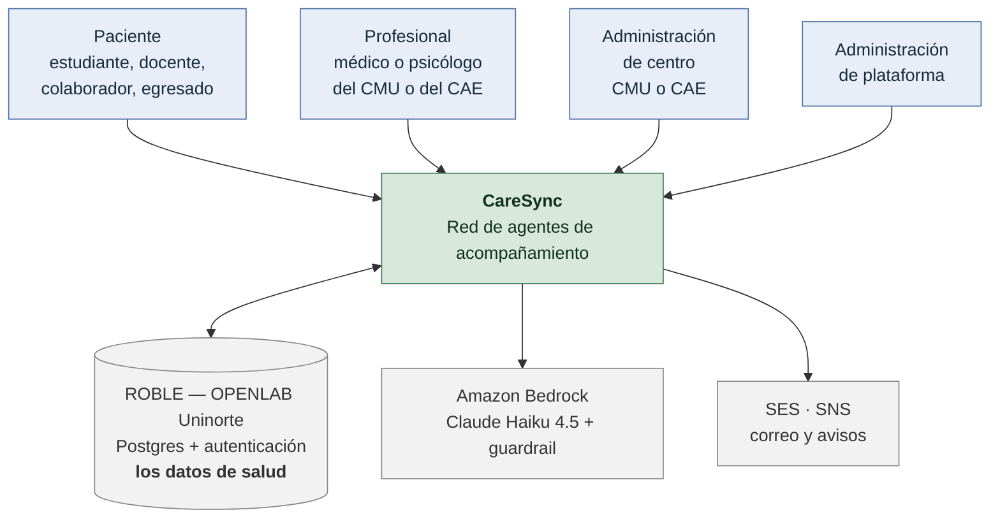
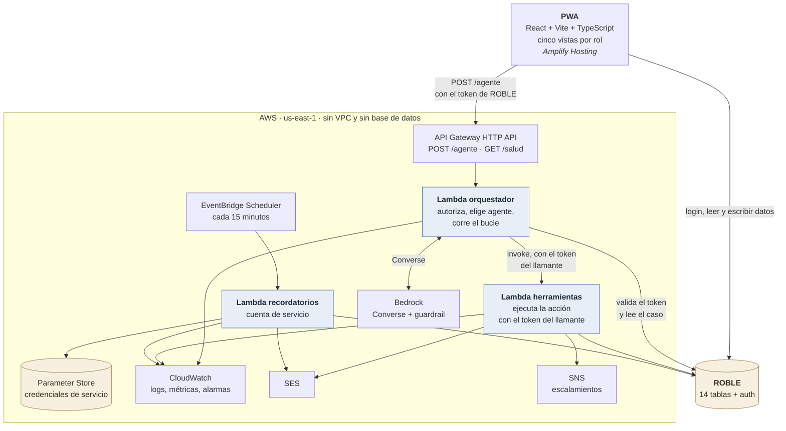
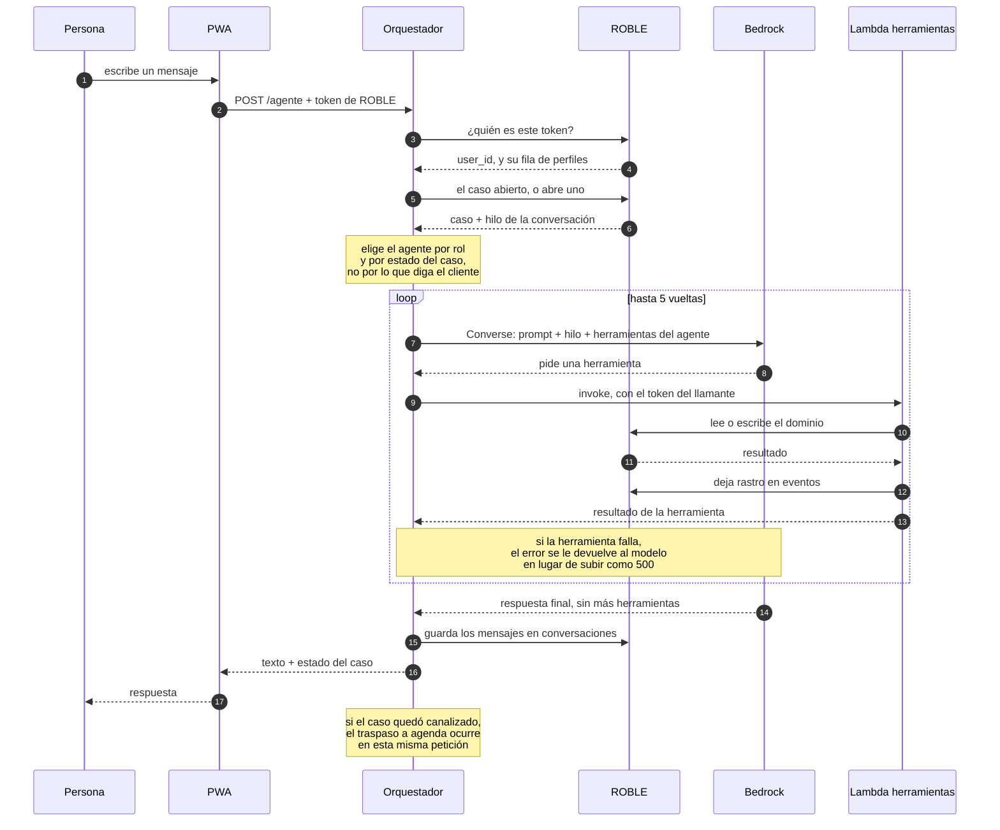
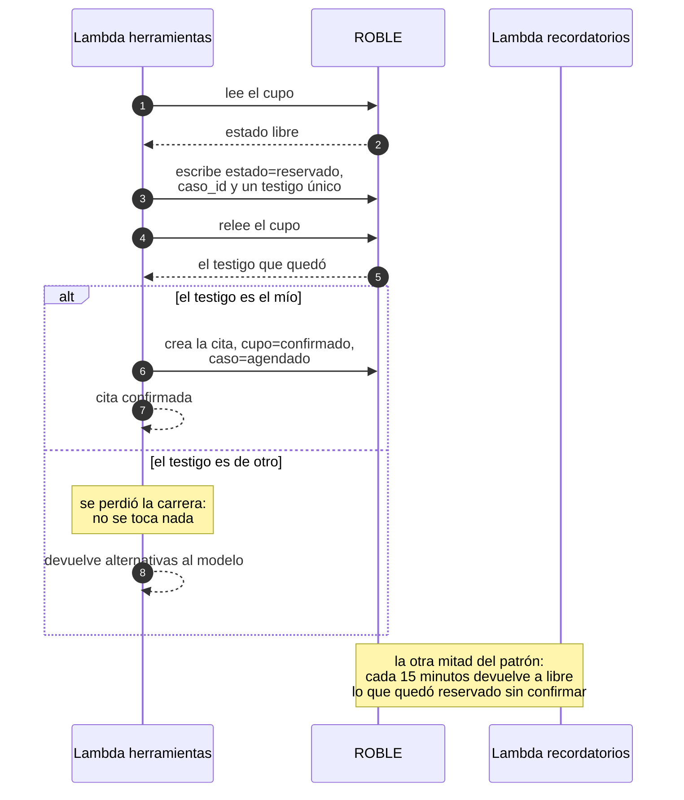
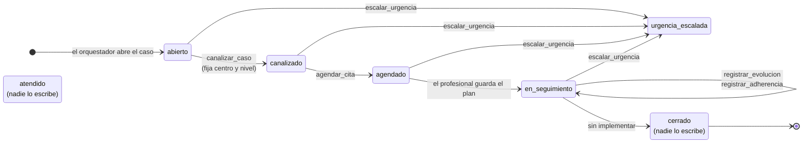
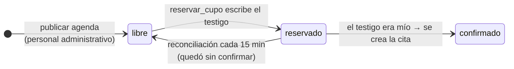
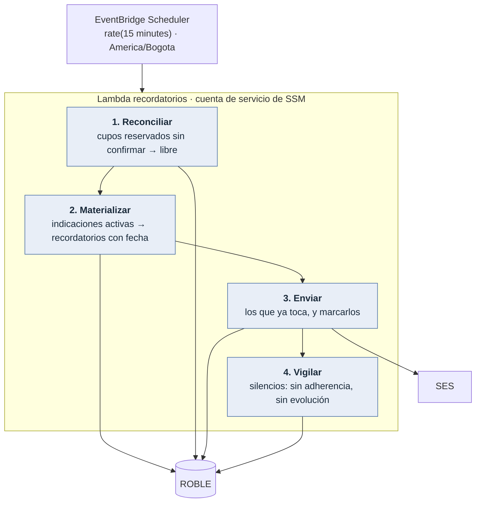
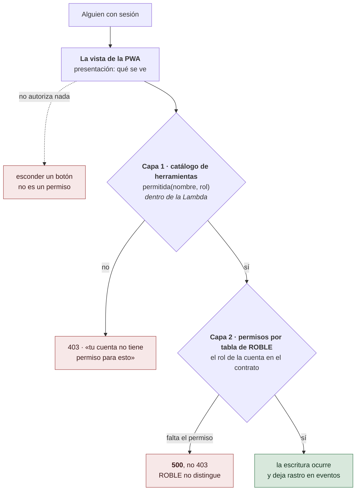

# Diagramas

Los diagramas del sistema, en Mermaid. GitHub los renderiza en la web; en un editor
hace falta la extensión, y para el informe se exportan desde
[mermaid.live](https://mermaid.live) pegando el bloque.

**En Mermaid y no en una imagen** por la misma razón por la que los protocolos están en
Markdown: un `.png` exportado de una herramienta de dibujo se desactualiza en silencio y
nadie lo nota en una revisión de código. Aquí el diagrama se lee en el diff.

Cada diagrama dice qué archivo describe. Si uno discrepa del código, el código manda y
el diagrama es el que hay que corregir.

- [1. Contexto](#1-contexto)
- [2. Contenedores](#2-contenedores)
- [3. Una vuelta del bucle de herramientas](#3-una-vuelta-del-bucle-de-herramientas)
- [4. Reservar un cupo sin escrituras condicionales](#4-reservar-un-cupo-sin-escrituras-condicionales)
- [5. Estados del caso](#5-estados-del-caso)
- [6. Estados del cupo](#6-estados-del-cupo)
- [7. El trabajo por reloj](#7-el-trabajo-por-reloj)
- [8. Las dos capas de autorización](#8-las-dos-capas-de-autorización)

## 1. Contexto

Quién usa el sistema y con qué habla. La división que lo explica todo: **los datos de
salud están en ROBLE, no en AWS**.

La conversación completa de un caso vive en ROBLE y **no pasa por CloudWatch**: los
logs llevan identificadores y métricas, nunca el texto de lo que alguien contó.

## 2. Contenedores

Qué se despliega y quién habla con quién. Corresponde a
[`infra/`](../infra/), [`lambdas/`](../lambdas/) y [`app/`](../app/); el razonamiento
está en [`arquitectura.md`](arquitectura.md).

Tres cosas que este diagrama deja ver de un golpe:

- **No hay base de datos en AWS.** Ni RDS, ni DynamoDB para la aplicación, ni VPC. La
  única tabla de DynamoDB del proyecto es el bloqueo del estado de Terraform.
- **Las Lambdas no tienen credenciales de datos.** Actúan con el token de quien llama,
  así que por la API nadie lee lo que ROBLE no le dejaría leer.
- **La excepción está aislada y es explícita.** La Lambda de recordatorios corre por
  reloj, no tiene un usuario que la autorice, y es la única que usa una cuenta de
  servicio cuya contraseña vive en Parameter Store.

## 3. Una vuelta del bucle de herramientas

El camino de un mensaje. Describe
[`lambdas/orquestador/handler.py`](../lambdas/orquestador/handler.py) y
[`bedrock_conversa.py`](../lambdas/orquestador/bedrock_conversa.py).

Al agotar las cinco vueltas se pide una respuesta final **sin herramientas**: la
persona recibe algo dicho y no un error, y el gasto tiene tope.

## 4. Reservar un cupo sin escrituras condicionales

El patrón que compensa la limitación más incómoda de ROBLE: no hay
`UPDATE ... WHERE estado = 'libre'` ni transacciones. Describe `reservar_cupo` en
[`roble_acceso.py`](../lambdas/comun/caresync_comun/roble_acceso.py).

## 5. Estados del caso

Describe las constantes `CASO_*` de
[`roble_acceso.py`](../lambdas/comun/caresync_comun/roble_acceso.py) y quién las
escribe. **Dos estados están declarados y nadie los escribe**, y el diagrama lo dice en
lugar de dibujar un ciclo de vida que no existe.

`urgencia_escalada` **no es terminal**: escalar activa la ruta de emergencia del campus
y después se sigue acompañando a la persona.

`atendido` y `cerrado` se leen —tres pantallas filtran por `cerrado`, y
`agente_por_defecto` manda a seguimiento con `atendido`— pero ninguna ruta los escribe.
Hoy un caso vive para siempre en `en_seguimiento`. Cerrarlo pide decidir quién lo hace
y qué pasa con los recordatorios pendientes; esa mitad ya está resuelta, porque el
trabajo por reloj los cancela cuando el caso está `cerrado`.

## 6. Estados del cupo

La agenda no nace sola: `horarios` es una plantilla semanal y alguien tiene que
publicar los `cupos` desde la vista administrativa. Hay un tope de 400 filas por tanda,
para que un clic no pueda escribir miles de filas en ROBLE.

## 7. El trabajo por reloj

Cuatro tareas independientes cada 15 minutos: si una falla, las otras corren igual.
Describe [`lambdas/recordatorios/handler.py`](../lambdas/recordatorios/handler.py).

Nada reintenta a mano: si la invocación falla entera, Scheduler la repite, y las cuatro
tareas son idempotentes dentro de la misma ventana. Un silencio no es una alarma
clínica, pero es lo que el profesional necesita ver antes de la siguiente consulta.

## 8. Las dos capas de autorización

**Esconder un botón no es un permiso.** Lo que autoriza de verdad son dos capas
independientes, y esto es lo que hay que tener en la cabeza para depurar un 403 o un
500.

Las dos capas leen **roles distintos que se llaman parecido**, y confundirlos cuesta una
tarde:

| | Dónde vive | Qué decide |
|---|---|---|
| **Rol de CareSync** | la columna `rol` de `perfiles` | qué ve la persona y qué herramientas puede llamar |
| **Rol de ROBLE** | la cuenta, en la consola del contrato | si la consulta a la tabla se permite |

Un `admin_plataforma` necesita **los dos**: la fila en `perfiles` y el rol `plataforma`
en ROBLE. Y los permisos de ROBLE viajan en el token, así que un cambio de rol surte
efecto **en el siguiente inicio de sesión**, no antes. Ver
[`runbook-roble.md`](runbook-roble.md#roles).
